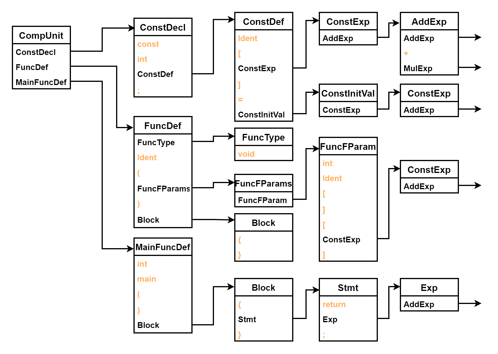
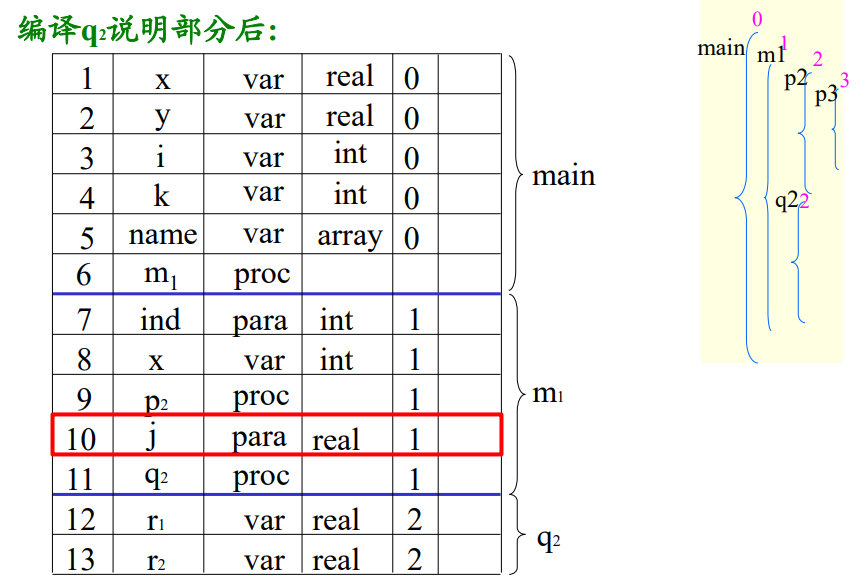

# 编译器设计文档
<!-- TOC -->

- [编译器设计文档](#编译器设计文档)
  - [0.观前提示](#0观前提示)
  - [1.参考编译器介绍](#1参考编译器介绍)
  - [2.编译器总体设计](#2编译器总体设计)
    - [1.总体结构](#1总体结构)
    - [2.接口设计](#2接口设计)
    - [3.文件组织](#3文件组织)
  - [3.词法分析设计](#3词法分析设计)
    - [1.总述](#1总述)
    - [2.编码前的设计](#2编码前的设计)
    - [3.编码后的修改](#3编码后的修改)
  - [4.语法分析设计](#4语法分析设计)
    - [1.总述](#1总述-1)
    - [2.编码前的设计](#2编码前的设计-1)
    - [3.编码后的修改](#3编码后的修改-1)
  - [附录 期中考试解析](#附录-期中考试解析)
    - [1.题目说明](#1题目说明)
    - [2.repeat/until](#2repeatuntil)
    - [3.Hexadecimal](#3hexadecimal)
  - [5.错误处理](#5错误处理)
  - [5.5 语法分析小重构](#55-语法分析小重构)
    - [1.抽象语法树的构建](#1抽象语法树的构建)
    - [2.抽象语法树的生成](#2抽象语法树的生成)
  - [6.代码生成](#6代码生成)
    - [1.总述](#1总述-2)
    - [2.编码前的总设计](#2编码前的总设计)
    - [3.main函数（Lab1）](#3main函数lab1)
    - [4.常量表达式（Lab2）](#4常量表达式lab2)
      - [1.四则运算](#1四则运算)
      - [2.负号处理](#2负号处理)
    - [5.局部变量（Lab3）](#5局部变量lab3)
      - [1.局部变量与赋值](#1局部变量与赋值)
      - [2.调用函数](#2调用函数)
    - [6.作用域与全局变量（Lab5）](#6作用域与全局变量lab5)
      - [1.作用域与块](#1作用域与块)
      - [2.全局变量](#2全局变量)
    - [7.函数1（Lab8-1）](#7函数1lab8-1)
      - [1.函数定义](#1函数定义)
      - [2.函数调用](#2函数调用)
    - [8.条件语句（Lab4）](#8条件语句lab4)
      - [1.if语句与条件表达式](#1if语句与条件表达式)
      - [2.短路求值](#2短路求值)
    - [9.循环（Lab6）](#9循环lab6)
      - [1.while循环](#1while循环)
      - [2.break和continue](#2break和continue)
    - [10.数组（Lab7）](#10数组lab7)
    - [11.函数2（Lab8-2）](#11函数2lab8-2)
  - [7.测试样例](#7测试样例)
  - [8.总结感想](#8总结感想)

<!-- /TOC -->

## 0.观前提示
**不要抄袭！不要抄袭！不要抄袭！**

编译的实验查重是很严格的。不论是往届代码还是本届代码，切记一定不要抄袭！否则被查出来会很难顶。
## 1.参考编译器介绍
由于选择了 **`Java`** 进行编译器的编写，那么设计的思维一定是面向对象的思维。由于一个好的架构能在迭代开发中减少很多不必要的重构，所以在设计之前我参考了 《**Head First 设计模式**》一书，作为整体设计架构的一个指导。同时，积极与助教沟通，尤其是参加过编译大赛的助教，他们在编译器架构方面的考虑也有独到的见解。
## 2.编译器总体设计
### 1.总体结构
总体结构按照编译顺序，即**词法分析**、**语法分析**、**语义分析**、**代码生成**四个部分，每一个部分单独设置文件包，然后在入口程序分别执行，即四个部分采用**四遍**运行。然后每一个部分**接收上一个部分的输入**，然后**把输出传递给下一个部分**。这样的过程就形成了类似一个**单向链**，每一个部分都是一个**单独的模块**，这样就可以**方便的进行每一步单元测试**，且一个模块的重构不会影响其他模块。

### 2.接口设计
接口设计采用类似**工厂模式**的设计方法，即每一个部分都有一个**入口程序**，然后在入口程序中调用相应的**分析器**，分析器中调用相应的**工厂类（词总表/符号表）**，工厂类中调用相应的**基础类（词）**同时实现类中调用相应的方法。每一个工厂的入口程序暴露给总入口 **`Compiler.java`** ，总入口程序调用相应的入口程序，然后调用相应的分析器。 **`Compiler.java`** 的代码如下
```java
public class Compiler{
public static void main(String[] args)throws Exception{
    BufferedReader filereader=new BufferedReader(new FileReader("testfile.txt"));
    FileWriter fw =new FileWriter("output.txt", false);
    int n=1;
    int check=0;
    String  str;
    Split sentence = new Split();
    //按行读入
    while((str=filereader.readLine())!=null){
        //词法分析
        sentence.setSentence(str,check,n);
        sentence.output();
        check=sentence.getCheck();
        //行号递增
        n+=1;
    }
    //语法分析，使用词法得到的Token表格
    SyntaxMain syntax = new SyntaxMain(sentence.getBank());
    syntax.analyze();
    //语义分析，使用词法得到的Token表格，包含语法，语法+语义+错误一遍处理
    //SemanticMain semantic = new SemanticMain(sentence.getBank());
    //semantic.analyze();
    //生成中间代码
    LLvmMain llvmMain = new LLvmMain(syntax.getAst());
    llvmMain.generate();
    filereader.close();
}
}
```

同时，每个部分的入口程序都是一个**单独的类**，这样就可以**方便的进行单元测试**，同时也可以让把每一部分的内部过程隐藏，这样入口函数可以使用该模块的所有功能，将其封装，从而对于总入口函数 **`Compiler.java`** 来说，每一个模块都是一个**黑盒**，只需要输入上层的输入，然后接收这层给的输出，给下一个模块即可。

例如，对于语义分析， **`Compiler.java`** 中的代码如下

```java
SyntaxMain syntax = new SyntaxMain(sentence.getBank());
syntax.analyze();
LLvmMain llvmMain = new LLvmMain(syntax.getAst());
```
不难发现，构造函数传入的是上一个黑盒————词法分析的输出，然后直接调用 **`analyze()`** 方法进行语法分析，而其生成的语法树则是通过 **`getAst()`** 方法获取并交给 **代码生成`LLvmMain类`** 的的，这样就可以将语法分析的内部过程隐藏，从而使得 **`Compiler.java`** 只需要知道语法分析的输入和输出即可。

而对于每个部分的入口函数，则是对底层代码的**进一步封装**，使得上层的代码更加简洁，例如，对于语义分析，其入口函数 **`SemanticMain.java`** 的代码如下
```java
public class SemanticMain{
    public ArrayList<Token> bank=new ArrayList<>();
    FileWriter fw1 =new FileWriter("error.txt", false);
    FileWriter fw2 =new FileWriter("TokenList.txt", false);
    SemanticProcedure semanticProcedure= null;
    public SemanticMain(ArrayList<Token> bank) throws IOException{
        this.bank=bank;
    }
    public void analyze(){
        semanticProcedure= new SemanticProcedure(bank);
        semanticProcedure.analyze();
        semanticProcedure.check();
        semanticProcedure.finalErrorOutput();
    }
}
```
不难发现，入口函数内，我们将其底层要输出的文件进行**初始化**，同时创建一个分析程序 **`SemanticProcedure`**，其构造函数获取上一模块的输入，然后分析程序调用 **`analyze()`** 方法进行 **`语法/语义分析`** ，调用 **`check()`** 方法进行 **`符号表`** 的检查，最后调用 **`finalErrorOutput()`** 方法输出 **`错误处理`** 。对该模块测试可以在这里添加方法，而这三个方法封装在一个 **`analyze()`** 内，供主程序直接调用。

### 3.文件组织
文件组织采用**一遍一个package**的结构，每一个package作每一个单独的步骤。具体结构如下：
```bash
src
│  Compiler.java #入口程序
│
├─Datam
│      AstNode.java #语法树节点类
│      ErrorLine.java #错误类
│      KeyValue.java #真实值类
│      Token.java #标识符类
│
├─Lexical
│      Split.java #分词器
│      WordCheck.java #单词分析器
│
├─LLVM
│      Generator.java #代码生成器
│      LLvmMain.java #代码生成入口程序
│ 
├─Semantic
│      SemanticMain.java #语义分析入口程序
│      SemanticProcedure.java #语义分析器
│
└─Syntax
       SyntaxMain.java #语法分析入口程序
       SyntaxProcedure.java #语法分析器（直接输出）
       SyntaxProcedure2.java #语法分析器（抽象语法树前序遍历）
```
## 3.词法分析设计


### 1.总述
词法分析的总任务是从源程序中识别出单词，记录单词类别和单词值。在词法分析的设计中给了一张表，其中有三项是加粗说明的，分别是 **`变量名（Ident）`**，**`整常数（IntConst）`** 和 **`格式字符串（FormatString）`** 而剩下都可以认为是 **`特殊字符`**。

仔细思考之后，发现，词法分析的作业本质上就是把文件转换成一个个的词，在之后的文章中我们称之为 **`Token`**。然后再把分出来的Token进行类别的判断，最后输出。

### 2.编码前的设计
编码的第一个关键在于，如何将读入的文件流转换成一行行读入，因为日后进行错误处理的时候，我们需要存储每一个Token的行号。所以最后经过查询后，确定采用**readline()函数**来进行读取。而文件的读入采用BufferedReader的方式进行读取，输出则直接图方便改变输出流来实现文件写入。
```java
BufferedReader filereader=new BufferedReader(new FileReader("testfile.txt"));
PrintStream out = System.out;
System.setOut(new PrintStream("output.txt"));
```

第二个关键在于，如何对分词，现在我们有一行行的字符串，我们要将其分成一个个词，这个时候我们需要一个 **`分词器`**，我们只要向其中输入整一行的字符串即可。
```java
int n=1;//行号
Split sentence = new Split();
//按行读入
while((str=filereader.readLine())!=null){
    sentence.setSentence(str,n);
    sentence.output();
    //行号递增
    n+=1;
}
```
然后对于最关键的分词部分，由于可变的Token只有Ident，IntConst和FormatString，发现这三类都是可变的单词，而分割Token的时候大多以 **`分界符`** 和 **`空格`**（包括空格，\n，\r，\t）为界，所以我们可以将分界符和空格都看作是 **`分隔符`**。而可以将整个一行字符串分成一个 **char型数组**，然后一个个字符去扫描。然后创建一个动态字符串word，正常情况下，每扫描到一个字符，就将其接到word中。
```java
String Sentence;
String word="";
char letter[];
letter=Sentence.toCharArray();

// void output()
word=word+letter[i];
```
如果**分隔符是空格**，那么word里面是一个 **`单词`**，这时候word就是一个Token。然后我们只需要对word进行 **单词判断**，然后清空word字符串，接着继续输出即可。

```java
if(letter[i]==' '||letter[i]=='\n'||letter[i]=='\r'||letter[i]=='\t'){wordcheck();}
```

如果**分隔符是分界符**，那么此时word一定也是 **`单词`**，我们只需要先对word进行处理，再对我们当前的分界符进行处理，即可获得两个Token。然后清空word字符串，接着继续输出即可。
```java
public void wordcheck(){
    if(word!=""){
        WordCheck w = new WordCheck();
        w.setWord(word);
        w.output();   
        word="";
    }
}
```
对于 **`特殊字符`**，可以采用**哈希表**预先存起来，然后只需要直接调用**containsKey()方法**判断，即可知道该token是不是特殊字符。
```java
//存储特殊字符
HashMap <Character,String> SingleCharacter = new HashMap<Character,String>();
SingleCharacter.put('+',"PLUS");
SingleCharacter.put('-',"MINU");
SingleCharacter.put('*',"MULT");
SingleCharacter.put('%',"MOD");
SingleCharacter.put(';',"SEMICN");
SingleCharacter.put(',',"COMMA");
SingleCharacter.put('(',"LPARENT");
SingleCharacter.put(')',"RPARENT");
SingleCharacter.put('[',"LBRACK");
SingleCharacter.put(']',"RBRACK");
SingleCharacter.put('{',"LBRACE");
SingleCharacter.put('}',"RBRACE");

//判断是否是特殊字符
else if(SingleCharacter.containsKey(letter[i])){
    wordcheck();
    System.out.println(SingleCharacter.get(letter[i])+" "+letter[i]);
}
```
按照上面的算法流程，我们可以发现，word内不可能存在分隔符，如此看来，word内的 **`单词`** 就包含三种情况：**`保留字，标识符，整型常量。`**，因为分隔符内不包含引号，所以只要读到引号，我们就可以直接读取 **`格式字符串`**，直到下一个引号。
```java
else if(letter[i]=='"'){
    wordcheck();
    i+=1;
    while(letter[i]!='"'){
        word=word+letter[i];
        i+=1;
    }
    System.out.println("STRCON \""+word+"\"");
    word="";
}
```

最后，对于word我们只需要判断，他是不是 **`保留字`**，是不是 **`整常数`** 即可，如果都不是，那么就是 **`标识符`**。
```java
    public void output(){
            if(ReservedWords.containsKey(word)){
                System.out.println(ReservedWords.get(word)+" "+word);
            }
            else{
                char letter[]=word.toCharArray();
                if(letter[0]>='0'&&letter[0]<='9'){
                    if(isNumber(word)){
                       System.out.println("INTCON "+word);
                    }
                }
                else{
                    System.out.println("IDENFR "+word);
                }
            }
        }
    public static boolean isNumber(String str) {
        for (int i=0;i<str.length();i++) {
            if (!Character.isDigit(str.charAt(i))) {
                return false;
            }
        }
        return true;
    }
```

### 3.编码后的修改
在实际的编码过程中，我们发现，由于本程序是单个字符读取，故对于如 `<` 和 `<=` 这样的符号，我们无法判断，所以在遇到这种双字符的符号时，我们就会采取**预读**的措施
```java
else if(letter[i]=='<'){
    if(i==letter.length-1||letter[i+1]!='='){
        now=i;
        wordcheck();
        System.out.println("LSS <");
    }
    else{
        now=i;
        wordcheck();
        System.out.println("LEQ <=");
        i+=1;
    }
}
```

同时，对于 **`/* */`** 和 **`//`** 的注释写法有所不同，因为我们是一行行进入分词器的，对于 **`//`** 的判断，只要读取到，则可以直接结束该行的分词。而对于 **`/* */`** ，由于注释可以**跨行**，故我们需要外加一个**check**来判断此时**是否需要进行分词**
```java
else if(letter[i]=='/'){
    if(i==letter.length-1||letter[i+1]!='/'&&letter[i+1]!='*'){
        wordcheck();
        System.out.println("DIV /");
    }
    else{
        wordcheck();
        if(letter[i+1]=='/'){
            break;
        }
        else if(letter[i+1]=='*'){
            this.check=1;
            i+=1;
        }
    }
}
```

如果此时是注释且没有读到 **`*/`** ，则直接读下一个字符，否则进行**分词**
```java
if(this.check==1){
    if(i==letter.length-1||!(letter[i]=='*'&&letter[i+1]=='/')){
        continue;
    }
    else{
        i=i+1;
        this.check=0;
    }
}
```

相应的，最外层也要增加这个参数
```java
while((str=filereader.readLine())!=null){
    sentence.setSentence(str,check,n);
    sentence.output();
    check=sentence.getCheck();
    //行号递增
    n+=1;
}
```

由此， **`词法分析`完成**

## 4.语法分析设计
### 1.总述
语法分析的总任务将源程序，通过给定的文法，分析其程序运行的顺序。在语法分析中，我们采用最朴素的 **`递归下降子程序`** 的方法去运行我们的程序。而这种做法就需要我们把之前获取到的Token传入文档中，所以需要对之前的文法进行一定的修改。
### 2.编码前的设计
首先对文法进行一定的小修改，首要目标是要**有序存储Token**，故建立Token类，包含**Token内容（content）**，**Token所在行号（lineNumber）**，**首字母在该行的字符数（wordNumber）**
```java
public class Token{
    String content;
    Integer lineNumber;
    Integer wordNumber;
    public Token(String content,Integer lineNumber,Integer wordNumber){
        this.content=content;
        this.lineNumber=lineNumber;
        this.wordNumber=wordNumber;
    }
}
```
然后在 **`词法分析`** 进行修改，我们用 **startCharacter** 来记录word字符串的首个字符的wordNumber，然后再在分完词后再实时更新每个词的起始位置。为了达到**有序存储**，我们可以采用**ArrayList**来存储Token。由于语法分析的输出和词法输出是在**一遍**内完成，所以我们可以将输出统一放到 **`语法分析`** 那一遍内完成。
```java
public ArrayList<Token> bank=new ArrayList<>();
//增加存储Token
if(SingleCharacter.containsKey(letter[i])){
    now=i;
    wordcheck();
    //System.out.println(SingleCharacter.get(letter[i])+" "+letter[i]);
    Token t = new Token(String.valueOf(letter[i]),lineNumber,this.startCharacter);
    bank.add(t);
    this.startCharacter=i+1;
}
```
然后设计语法分析的入口函数
```java
public class SyntaxMain{
    public ArrayList<Token> bank=new ArrayList<>();
    public SyntaxMain(ArrayList<Token> bank){
        this.bank=bank;
    }
    public void analyze(){
        SyntaxProcedure syntaxProcedure= new SyntaxProcedure(bank);
        syntaxProcedure.analyze();
    }
}
```
然后再在主函数增加语法分析
```java
SyntaxMain syntax = new SyntaxMain(sentence.getBank());
syntax.analyze();
```

那么接下来我们只需要在**SyntaxProcedure**内编写 **`递归下降子程序`** 即可。可以事先准备好一个指针**current**，表示目前读到第几个Token，同时用**sym**用于判断目前的Token内容，便于程序判断。仿照递归下降子程序，我们可以编写**nextsym()**函数，用于读取下一个Token，顺便进行**词法的输出**。同时，我们预留读取下一个，辖两个，上一个Token的函数，用于**预读和重读**的使用。然后入口函数选择**CompUnit()**，即从程序开始处开始分析。
```java
public void nextsym(){
    output(this.sym);
    if(this.current<bank.size()-1){
        this.current+=1;
        this.sym=bank.get(this.current).getContent();
    }
}
public String getnextsym(){return bank.get(this.current+1).getContent();}
public String getbeforesym(){return bank.get(this.current-1).getContent();}
public String getnextnextsym(){return bank.get(this.current+2).getContent();}
public void analyze(){CompUnit();}
```
根据**递归下降子程序**的实现方法，我们只需要自顶向下分析每一条文法中每一个Token是否符合要求即可，并在最后输出文法左值即可。我们以**CompUnit()**为例
```java
//CompUnit → {Decl} {FuncDef} MainFuncDef
public void CompUnit(){
    while(sym.equals("const")||sym.equals("int")&&isIdent(getnextsym())&&!getnextnextsym().equals("(")){
        if(sym.equals("const")){ConstDecl();}
        else{VarDecl();}
    }
    while(sym.equals("void")||sym.equals("int")&&isIdent(getnextsym())&&getnextnextsym().equals("(")){FuncDef();}
    if(sym.equals("int")&&getnextsym().equals("main")){MainFuncDef();}
    else{}
    output("<CompUnit>");
}
```

那么根据递归下降子程序的规定，我们首先要对文法做处理，即
- 消除左递归
- 解决回溯问题

对于包含左递归的文法，我们只需要修改文法即可，如
```java
AddExp → MulExp | AddExp ('+' | '−') MulExp
可以改成
AddExp → MulExp { ('+' | '−') MulExp }
```
而解决回溯的问题，我们需要先获取所有的 **`First集`** 和 **`Follow集`** ，然后再根据 **`First集`** 和 **`Follow集`** 来判断是否有回溯问题，如果有回溯问题，我们需要对文法进行修改。
对于有左公因子的文法，我们可以提取左公因子，如
```java
VarDef → Ident { '[' ConstExp ']' } | Ident { '[' ConstExp ']' } '=' InitVal
可以改成
VarDef → Ident { '[' ConstExp ']' } [ '=' InitVal ]
```

然而，在实际操作中，我们可以进行 **预读** 操作，即可以预先读取多个字符，然后再进行判断，这样就可以巧妙地解决回溯问题。例如，对于下面的文法
```java
UnaryExp → PrimaryExp | Ident '(' [FuncRParams] ')'
PrimaryExp → '(' Exp ')' | LVal | Number
LVal → Ident {'[' Exp ']'} 
```
如果执行**UnaryExp**的First集，不难发现 `UnaryExp → PrimaryExp → LVal → Ident {'[' Exp ']'}`和 `UnaryExp → Ident '(' [FuncRParams] ')'`的First集合都包含**Ident**，此时提取左公因子修改文法显然十分麻烦，所以我们可以**预读**，即读完Ident这个Token后**再读一个Token**。由于默认给的代码都是不带错误的，所以读完Ident后只可能是两种情况，即如果是**小括号`（`**，则执行后者，否则执行前者。这样就可以巧妙地解决回溯问题。
```java
public void UnaryExp(){
    if(sym.equals("+")||sym.equals("-")||sym.equals("!")){UnaryOp();UnaryExp();}
    else if(sym.equals("(")||isNumber(sym)){PrimaryExp();}
    else if(isIdent(sym)){
        if(getnextsym().equals("(")){nextsym();nextsym();
            if(sym.equals("(")||sym.equals("+")||sym.equals("-")||sym.equals("!")||isIdent(sym)||isNumber(sym)){FuncRParams();}
            if(sym.equals(")")){nextsym();}
            else{}
        }
        else{PrimaryExp();}
    }
    else{}
    output("<UnaryExp>");
}
```
最后，由于文法和词法一起输出，我们需要对输出函数output()进行修改，使之能同时按顺序输出**文法和词法**
```java
public void output(String sym){
    FileWriter fw =null;
    try {fw=new FileWriter("output.txt", true);} //输出到同一个文件
    catch (IOException e) {e.printStackTrace();}
    PrintWriter pw = new PrintWriter(fw);
    //语法输出，首字符一定是"<",且为了防止其和"< LSS","<= LEQ"冲突
    //首字母后一定是大写英文字母，由此判断这是语法输出
    if(sym.charAt(0)=='<'&&sym.length()>1&&sym.charAt(1)-'A'>=0&&sym.charAt(1)-'A'<26){
        pw.println(sym);
        pw.flush();
    }
    //此后与之前的词法输出一样
    else if(ReservedCharacter.containsKey(sym)){
        pw.println(ReservedCharacter.get(sym)+" "+sym);
        pw.flush();
    }
    else{
        if(sym.charAt(0)=='"'){
            pw.println("STRCON "+sym);
            pw.flush();
        }
        else if(isNumber(sym)){
            pw.println("INTCON "+sym);
            pw.flush();
        }
        else{
            pw.println("IDENFR "+sym);
            pw.flush();
        }
    }
}
```
### 3.编码后的修改
实际编码的时候，我们发现，在**消除左递归文法**的时候，变相更改了期望输出，例如
```java
1+2
文法1：
AddExp → MulExp | AddExp ('+' | '−') MulExp

Output：
INTCON 1
<MulExp> // 1
<AddExp> // 1
PLUSTK +
INTCON 2
<MulExp> // 2
<AddExp> // 1+2

文法2：
AddExp → MulExp { ('+' | '−') MulExp }

Output：
INTCON 1
<MulExp> // 1
PLUSTK +
INTCON 2
<MulExp> // 2
<AddExp> // 1+2
```
我们发现，更改后虽然不妨碍递归下降子程序的运行，但是输出少了一个 **\<AddExp>**，这时候我们就发现，只要其不是AddExp的**最后一项**，我们就一定要输出一遍 **\<MulExp>** 后再输出一遍 **\<AddExp>** 。故在函数调用后我们需要**额外判断**是否为最后一项
```java
public void AddExp(){
    if(sym.equals("(")||sym.equals("+")||sym.equals("-")||sym.equals("!")||isIdent(sym)||isNumber(sym)){MulExp();
        while(sym.equals("+")||sym.equals("-")){
            output("<AddExp>");
            nextsym();MulExp();
            if(getbeforesym().equals("+")||getbeforesym().equals("-")){
                output("<AddExp>");
            }
        }
    }
    else{}
    output("<AddExp>");
}
```
同理，从**LOrExp**一步步到**MulExp**这些消除左递归的文法，都需要额外判断一遍。

同时，在编写 **`Stmt`** 的时候，有以下三条导出式

- Stmt → LVal `'='` Exp `';'` // 每种类型的语句都要覆盖
- Stmt → [Exp] `';'` //有无Exp两种情况
- Stmt → LVal `'='` `'getint'` `'('` `')'` `';'`
- LVal → Ident
- Exp → AddExp → MulExp → UnaryExp → Ident `'('` [FuncRParams] `')'`

我们发现，**`Stmt`** 的导出式子中，**`LVal`** 和 **`Exp`** 都有可能包含**Ident**的首字符，这时候我们就需要采取**预读**的方法，我们发现，**`Stmt`** 的导出式子中，含有 **`LVal`** 的导出式在 **`LVal`** 之后一定包含 **`'='`** ，故我们只需要往后预读，只要读到 **`'='`** 就可以判断这个**Ident**是否是 **`Lval`** ，由于上述三个式子的末尾一定都有 **`';'`** 且在此之前不可能包含其他 **`'='`** 或者 **`';'`** ，所以只要在第一次读到 **`';'`** 前读到 **`'='`** 就返回**true**，否则返回**false**

```java
public boolean isLVal(){
    int j=this.current;// 记录起始位置
    int check=0;
    for(;j<this.bank.size()&&check==0;j++){
        if(check==0&&bank.get(j).getContent().equals("=")){return true;} //只要读到=就可以判断是否为LVal
        if(bank.get(j).getContent().equals(";")){check=1;}
    }
    return false;
}
```
在Stmt中便可以如下判断
```java
else if(isIdent(sym)){
    if(isLVal()){LVal();
        if(sym.equals("="))
        ···
    }
    else{Exp();
        if(sym.equals(";")){nextsym();}
        else{}
    }
}
```

至此，语法分析完成

项目结构如下

```bash
src
│  Compiler.java
│
├─Datam
│      Token.java
│
├─Lexical
│      Split.java
│      WordCheck.java
│
└─Syntax
       SyntaxMain.java
       SyntaxProcedure.java
```
## 附录 期中考试解析
> 这部分是考试完写的，题目准确率90%，可能有点小问题，仅供参考
> 
> 由于其他部分是需要上交的，这部分不用，所以这部分可能就~~夹带点私货~~了
### 1.题目说明
期中考试增加了两个地方，第一个是在 **`Stmt`** 增加了文法，第二个是增加了新的 **`数字类型`**

- 文法增加：
Stmt → `'repeat'` Stmt `'until'`  `'('`  Cond  `')'` 

- 文法修改：
Number → IntConst | `HexadecimalConst`

- 保留字增加：
  - `repeat` REPEATTK
  - `until` UNTILTK
  - 十六进制数 HEXCON

- 十六进制说明：
  - HexadecimalConst → HexadecimalPrefix HexadecimalDigit | HexadecimalConst HexadecimalDigit
  - HexadecimalPrefix → `'0x'` | `'0X'`
  - HexadecimalDigit → `'0'` |`'1'` |`'2'` |`'3'` |`'4'` |`'5'` |`'6'` |`'7'` |`'8'` |`'9'` |`'A'` |`'B'` |`'C'` |`'D'` |`'E'` |`'F'` |`'a'` |`'b'` |`'c'` |`'d'` |`'e'` |`'f'` 

一共十个样例点（这个具体怎么分的忘记了，但是应该不重要）
- **testfile 1-3** 只判断`源程序`
- **testfile 4-5** 只添加`repeat/until`
- **testfile 6-8** 只添加`十六进制`
- **testfile 9-10** 添加`repeat/until`和`十六进制`
### 2.repeat/until
一般的评分标准都有 **`什么都不加的源程序评分`** （简称送分题）第一步先直接下下来提交一版，看看能不能过送分题，如果过了，那么就可以开始写代码了；如果没过，那么就要看看源程序哪里出问题（不过应该大概率不会吧QAQ）

首先是词法的修改，即 **`repeat`** 和 **`until`** 俩保留字，所以可以先去 **`词法分析`** 增加两个保留字的识别

（然而我直接偷懒，因为testfile给的一定是**没有错误的文件**，故只要是个词我都扔进Token表中，统一放到Syntax下判断）

接下来是对 **`语法分析`** 的修改，首先是在 **`特殊字符`** 表中添加 **`repeat`** 和 **`until`** .
```java
ReservedCharacter.put("repeat","REPEATTK");
ReservedCharacter.put("until","UNTILTK");
```
然后是在 **`Stmt`** 中添加文法
```java
public void Stmt(){
    if(sym.equals("{")){Block();}
    else if···

    else if(sym.equals("repeat")){nextsym();Stmt();
        if(sym.equals("until")){nextsym();
            if(sym.equals("(")){nextsym();Cond();
                if(sym.equals(")")){nextsym();}
            }
        }
    }
    
    else if···
    output("<Stmt>");
}
```
然后在所有用到**Stmt的FIRST集**的地方添加**repeat**判断，包含
- `BlockItem` → Decl | `Stmt` 
- `Stmt` →  'if' '(' Cond ')' `Stmt` [ 'else' `Stmt` ]
- `Stmt` → 'while' '(' Cond ')' `Stmt`

仔细判断可以发现，后面两个文法中，我们实际写的时候**不需要判断Stmt的首字符**，因为Stmt的前面都是 **`终结符`**，所以不需要作修改。而 **`BlockItem`** 则需要判断首字符集来判断是 **`Decl`** 还是 **`Stmt`** ，所以需要添加 **`repeat`** 的判断。

然后，我们需要判断哪些地方用到了**BlockItem的首字符**集合
- `Block` → '{' { `BlockItem` } '}'

由于 **`BlockItem`** 是可以**重复0次或任意次**，故递归下降子程序中，我们要用 **`while`** 和 **`First集合`** 判断。所以再这里也需要添加 **`repeat`判断**

所以在上述**两处地方**递归下降子程序中增加
```java
||sym.equals("repeat")
```

（**小技巧**：因为只有Stmt里面用到了 **`repeat`** ，同理，只有Stmt里面用到了 **`return`** ，所以可以在`IDEA`中直接 **`Ctrl+F`** 搜索 **`return`** ，只要有 **`return`** 判断的地方，加上 **`repeat`** 判断就可以了）

此时提交一版，看看过了没有，如果过了，说明这个部分没有问题，可以继续开始下一部分。

### 3.Hexadecimal
这一部分是十六进制的数字，所以我们同样需要修改 **`词法分析`** 和 **`语法分析`** 两部分。

首先，一开始我们只需要判断 **`Number`** 类型是不是**整型数字**，而此时，Number不仅包含了整形，还包含了**十六进制**的判断，所以我们需要有一个能够判断十六进制的函数。

顺带一提，判断Number的时候，Java有**isDigit**的方法判断字符是否是数字，当然你可以去使用 [**`正则表达式`**](https://llleo-li-github-io.vercel.app/posts/a95e.html) （这里附上一篇同为小学期助教的李昊哥哥的博客，感兴趣的可以去学习一下）

这里我们采用最简单的判别方法，首先进行文法的修改，即消除左递归。修改后文法为

- HexadecimalConst → ( `0x` | `0X` ) HexadecimalDigit { HexadecimalDigit }

首先判断是否是 **`0`** ，如果是，判断下一个字符是否是 **`x/X`** ，如果是，那么接下来判断是否是十六进制数，即0-9/a-f/A-F，如果是，则返回true，否则返回false。

```java
public static boolean isHexadecimal(String str){
    if(str.length() < 2) { return false; }
    if(str.charAt(0) == '0'){
        if(str.charAt(1) == 'x' || str.charAt(1) == 'X'){
            for(int i = 2; i < str.length(); i++){
                if(!((str.charAt(i) >= '0' && str.charAt(i) <= '9') || (str.charAt(i) >= 'a' && str.charAt(i) <= 'f') || (str.charAt(i) >= 'A' && str.charAt(i) <= 'F'))){
                    return false;
                }
            }
            return true;
        }
    }
    return false;
}
```
其实还是可以投机取巧，因为给的文法**一定是正确的**，所以甚至只要判断 **`0x`** 或 **`0X`** 就可以了，因为**不可能有第二种以0x或0X打头的Token**

所以，假设之前判断是否是整数的函数叫**isNumber()**，那么我们只需要把之前的判断内容换成另一个函数，在原函数下增加一个判断即可，这样递归下降子程序可以不用更改，即
```java
public static boolean isInt(String str){
    for (int i=0;i<str.length();i++) {
        if (!Character.isDigit(str.charAt(i))) {
            return false;
        }
    }
    return true;
}
public static boolean isNumber(String str){
    return (isInt(str) || isHexadecimal(str));
}
```

最后，在输出的时候，只需要别忘了判断是输出 **`INTCON`** 还是 **`HEXCON`** 即可
```java
if(sym.charAt(0)=='<'&&sym.length()>1&&sym.charAt(1)-'A'>=0&&sym.charAt(1)-'A'<26){
    pw.println(sym);
    pw.flush();
}
else if(ReservedCharacter.containsKey(sym)){
    pw.println(ReservedCharacter.get(sym)+" "+sym);
    pw.flush();
}
else{
    if(sym.charAt(0)=='"'){
        pw.println("STRCON "+sym);
        pw.flush();
    }
    else if(isInt(sym)){
        pw.println("INTCON "+sym);
        pw.flush();
    }
    else if(isHexadecimal(sym)){
        pw.println("HEXCON "+sym);
        pw.flush();
    }
    else{
        pw.println("IDENFR "+sym);
        pw.flush();
    }
}
```
至此，十个样例点全部通过，考试完成，如果顺利的话**15-20分钟**就可以完成，所以不用慌张。


## 5.错误处理

## 5.5 语法分析小重构
由于之后的步骤是 **`中间代码`** 生成部分，这部分的输入需要采用 **`语法分析`** 的输出，故我们需要进行小规模重构，方便 **`中间代码`** 的生成。

### 1.抽象语法树的构建
在 **`语法分析`** 阶段，我们实际上做的就是用 **`词法分析`** 分出来的**Token**去匹配一条条文法。而现在，我们需要建立一个树，使得我们可以通过一条文法的**左部**找到对应的**右部**，然后通过**右部**找到对应的**Token**，这样我们就可以做到通过一条文法的根节点找到其下的所有**Token**。

接下来就是抽象语法树 **（AST）** 的建立，即如何去构建一个类似于语法树的数据结构，这个构建的方式因人而异。如果按照理论上的语法树构建，那么我们不难发现，这棵树上的结点中，叶结点一定是 **`终结符`** ，即词法分析分出来的Token，而非叶结点则一定是那张~~又臭又长的~~文法表的**左部**，例如，对于 $1+-2$ 这个表达式，我们可以构建出这样一棵树：
```java
                   <AddExp>
           ┌──────────┼─────────┐
        <AddExp>     "+"     <MulExp>
           |                    |
        <MulExp>            <UnaryExp>
           |              ┌─────┴─────┐
       <UnaryExp>     <UnaryOp>   <UnaryExp>
           |              |           | 
      <PrimaryExp>       "-"     <PrimaryExp>
           |                          |
        <Number>                   <Number>
           |                          |
          "1"                        "2"
```
不难发现，如果 $1+-2$ 放到我们 **`语法分析`** 去输出，其结果为
```java
INTCON 1
<Number>
<PrimaryExp>
<UnaryExp>
<MulExp>
<AddExp>
PLUS +
MINU -
<UnaryOp>
INTCON 2
<Number>
<PrimaryExp>
<UnaryExp>
<UnaryExp>
<MulExp>
<AddExp>
```
如果稍加观察，不难发现，**语法分析的输出**其实可以看做语法树的**前序遍历**。所以，我们可以将原先的 **`output()`** 函数替换为**增加一个结点**，最后对树进行一个**前序遍历**即可。

语法树的构建的数据结构因人而异，这里分享一种我的构造方法。我采用的是 **`ArrayList`** 方式。在 **`AstNode`** 类内包含一个**ArrayList**，这个**ArrayList**内每一项都是一个**AstNode**，由此可以构建一个类似于 **`树`** 的结构。



### 2.抽象语法树的生成

创建**AstNode**结点类如下：
```java
public class AstNode{
    String content="";
    ArrayList<AstNode> child = new ArrayList<AstNode>();
    public AstNode(String content){
        this.content=content;
    }
    /*添加子节点*/
    public void addNode(AstNode a){
        child.add(a);
    }
}
```
在语法分析中，我们可以先设立一个根节点，然后再在根节点下建立语法树
```java
AstNode RootAst = new AstNode("<CompUnit>");
public void analyze(){
        CompUnit(RootAst);//语法分析
        outputAst(RootAst);//遍历输出语法树
    }

```
然后对于原先的语法分析函数进行修改，每个函数传入的结点为**父节点**，然后在函数内部创建**子节点**，最后将子节点加入父节点的子节点列表中，最后返回父节点即可。

总结下来就是， **`自顶向下`** 进行 **`语法分析`** ，再 **`自底向上`** 构建 **`语法树`**

> 注：新增*new*的是在原基础上新增的代码，其余全是**原来的代码**
```java
public void MainFuncDef(/*new*/AstNode ast/*该节点的父节点，例如，MainFuncDef的父节点就是CompUnit*/){
    /*new*/
    AstNode a =new AstNode("<MainFuncDef>");//新建该结点，即MainFuncDef结点a
    if(sym.equals("int")){nextsym(a);//在a结点下添加子节点int
        if(sym.equals("main")&&getnextsym().equals("(")&&getnextnextsy().equals(")")){nextsym(a);nextsym(a);nextsym(a);Block(a);
        //在a结点下添加子节点main，(，)和Block，之后Block的根节点即为a，即Block在MainFuncDef下建立树
        }
        else{}
    }
    else{}
    /*new*/
    ast.addNode(a);//把已经建完的MainFuncDef树加到父节点CompUnit下
    output("<MainFuncDef>");//这个output其实已经没用了
}
```

然后，我们对 **`nextsym()`** 函数进行修改，使得 **`非终结符`** 可以加入到语法树中，即达到**自底向上建立语法树**的目的
```java
public void nextsym(AstNode ast){
    output(this.sym);
    /*new*/
    ast.addNode(new AstNode(this.sym));
    if(this.current<bank.size()-1){
        this.current+=1;
        this.sym=bank.get(this.current).getContent();
    }
}
```
然后语法分析的输出即为 **语法树的`前序遍历`**
```java
public void output(String sym){/*弃用*/}
public void outputAst(AstNode ast){
    ···
    if(ast.getChild().size()!=0){
        for(int i=0;i<ast.getChild().size();i++){
            outputAst(ast.getChild().get(i));
        }
        /*先遍历再输出结点内容，即前序遍历*/
        pw.println(ast.getContent());
        pw.flush();
    }
    else{/*输出终结符内容*/}
}
```
比较特殊的是 **`AddExp`** 一类代码。虽然也是在原基础上改动，但是还是要单独说一下。由于原先代码中，我们采用的是**读后面是否有操作符再判断是否输出 `< AddExp >`**，所以这里我们也是如此，如果读到了操作符，则**增加结点** ，分别连接前后节点。如果没有操作符，则直接连接结点。
```java
public void AddExp(/*new*/AstNode ast){
    /*new*/
    AstNode a =new AstNode("<AddExp>");
    if(sym.equals("(")||sym.equals("+")||sym.equals("-")||sym.equals("!")||isIdent(sym)|isNumber(sym)){MulExp(a); //在a结点（AddExp）下添加子节点MulExp
        while(sym.equals("+")||sym.equals("-")){  //如果后面有操作符，则说明该结点是AddExp
            /*new*/
            AstNode tmp=a.changeNode(); //新建一个临时结点tmp，存储a的最后一个子节点（即上一个MulExp结点），并在a下删除该节点
            AstNode b =new AstNode("<AddExp>"); //新建AddExp结点b
            b.addNode(tmp); //将tmp加入b的子节点列表中，即在原先MulExp结点上加上AddExp结点
            a.addNode(b); //将b加入a的子节点列表中，即把新的AddExp结点接在a结点下
            //一通操作下来，相当于把a的最后一个子节点（MulExp）中间加了一个AddExp结点

            output("<AddExp>");
            nextsym(a);MulExp(a);
            if(getbeforesym().equals("+")||getbeforesym().equals("-")){
                /*new*/
                AstNode tmp1=a.changeNode();
                AstNode b1 =new AstNode("<AddExp>");
                b1.addNode(tmp1);
                a.addNode(b1);

                output("<AddExp>");
            }
        }
    }
    else{}
    /*new*/
    ast.addNode(a);
    output("<AddExp>");
}
```
这样依旧可以保证**前序遍历的正确性**，但是其语法树构建方式比较独特，是下面这个样子
```
                                <AddExp>
    ┌─────┬──────┬─────┬──────┬─────┼──────┬─────┬──────┬─────┬──────┐
<AddExp>  +  <AddExp>  +  <AddExp>  +  <AddExp>  +  <AddExp>  +  <MulExp>
      
```
这种构建方法没有按照传统文法要求来构建语法树，但是和传统的文法构建的语法树**输出相同**，不影响语法分析的输出。且顺带一提，个人认为，上述 **`xxxExp`** 语法树的构建方式是整个编译器的**点睛之笔**，这一构建方式在代码生成2的 **`短路求值`** 中将**减少巨大复杂度**。

最后建立语法树**输出接口**，供 **`代码生成`** 使用
```java
// SyntaxProcedure2.java
public AstNode getAst(){
    return this.RootAst;
}
//SyntaxMain.java
public AstNode getAst(){
    return syntaxProcedure.getAst();
}
//Compiler.java
LLvmMain llvmMain = new LLvmMain(syntax.getAst());
```

自此，**语法树构建完成**，接下来进行 **`代码生成`** 。

## 6.代码生成

### 1.总述
本次 **`代码生成`** 是**分值最高**，也是前期**调研时间最长**的一部分。本次采用的是 **`LLVM IR`** 作为目标代码的生成，~~打算选 **`MIPS`** 和 **`PCode`** 的佬可以退了~~。尤其是 **`代码生成1`** 只有 **3周** 时间，给的时间还是太少了，**调研了一整周时间**，期间做了上述 **`语法分析的重构`** ，第二周才开始写 **`代码生成`** 并在两天内完成了 **`代码生成1`**，所以前期调研工作 **十分重要**。这里给出个人的一点点**调研结果**

**`PCode`** 需要做的是两步，第一步是 **翻译为`中间代码`** ，第二部是 **将中间代码`解释执行`**，即给程序标准输入后，要得到标准输出。PCode的优势显而易见，就是所有东西**理论都讲过**，例如书上的 **`三元式`/`四元式`** ，而且中间代码**不做考核**。也就是说，中间代码是三元式还是两元半式**无所谓**，完全看个人喜好，只要最后将其**解释运行**即可。代码方面只需要权衡 **`翻译器`** 和 **`解释器`** 哪个好做就行。

**`LLVM`** 相比就简单不少，首先目标代码就是中间代码，只需要做 **`翻译器`** ，平台的评测机不是对文本进行比对，而是将你生成的LLVM中间代码**喂给评测机去解释运行**，所以即使生成代码和要求不一样，结果也可能是对的。LLVM的好处包括但不限于：**代码生成方式多样**，寄存器标号可以**不按顺序**，且可以**无限叠加**，有一套**完整的教程**等。唯一的问题是需要去自学LLVM的语法。

**`MIPS`** 一开始可能就不在考虑范围内，所以调研可能不算全面，~~写 **`MIPS`** 的佬应该也不会看我的博客~~。 **`MIPS`** 和 **`PCode`** 相同，都需要 **`翻译器`** 和 **`解释器`** ，但与 **`PCode`** 不同的是， **`MIPS`** 的要首先将C翻译成中间代码，然后再把中间代码翻译到 **`MIPS`** ，因为后面代码优化需要考察中间代码。而且MIPS寄存器标号**只有32个**，还要用寄存器的话就要放到栈内。好处就是可以多去卷一卷竞速的分数。

在调研一周之后，果断投入 **`LLVM`** 的怀抱

### 2.编码前的总设计
由于LLVM的设计直接参考[往届软院编译实验](https://buaa-se-compiling.github.io/miniSysY-tutorial/pre/llvm.html)，所以编码设计顺序也按照上述实验来分析。 **`代码生成1`** 的实验包含**Lab1，2，3，5，8**。 **`代码生成2`** 的实验包含**Lab4，6，7**。且在每个实验之后会配一些自己认为比较强的**testfile**仅供参考。

还有一点**十分重要**，由于上述编译实验文档采用的版本是 **`LLVM10`** ，而本次实验采用的是 **`LLVM6`** ，可能会出现版本不兼容的情况。经过测试，以下写法均可适用于 **`LLVM10`** 与 **``LLVM6``**，方法就是把所有寄存器编号从**数字**改成**字符串**，即所有 **`%`** 后添加一串字母后再添加数字，这样 **`LLVM`** 在编译时会对寄存器重新编号，从而解决问题。

与前面一样，我们为代码生成设计**入口函数**
```java
//Compiler.java
LLvmMain llvmMain = new LLvmMain(syntax.getAst());
llvmMain.generate();
//LLvmMain.java
public class LLvmMain{
    AstNode compUnit = null;
    FileWriter fw1 =new FileWriter("llvm_ir.txt", false);
    Generator generator=null;
    public LLvmMain(AstNode t) throws IOException{this.compUnit=t;}
    public void generate(){
        generator = new Generator(compUnit);
        generator.init();
        generator.generating();
    }
}
//Generator.java
public class Generator{
    int level=0; //记录当前层级
    AstNode Rootast = null; //根节点
    int regId=1; //寄存器标号
    ArrayList <AstNode> stack = new ArrayList<>(); //栈式符号表
    HashMap <String,AstNode> global= new HashMap(); //全局符号表
    public Generator(AstNode ast){this.Rootast=ast;} //构造函数
    public void generating(){generate(this.Rootast);} //生成LLVM代码
    public void init(){ //生成固定的调用函数
        FileWriter fw=null;
        try {fw=new FileWriter("llvm_ir.txt",true);}
        catch (IOException e) {e.printStackTrace();}
        PrintWriter pw=new PrintWriter(fw);
        pw.println("declare i32 @getint()");pw.flush();
        pw.println("declare void @putint(i32)");pw.flush();
        pw.println("declare void @putch(i32)");pw.flush();
        pw.println("declare void @putstr(i8*)");pw.flush();
    }
}
```
然后我们采用的是 **`遍历语法树`** 的方式去生成代码。其实可以完全按照**递归下降子程序**那种方法，即**一个文法一个函数**，然后函数套函数那么去写，但是由于代码生成是**一步步去实现**的，而且在递归下降子程序的时候发现，没有写完所有文法函数前我们**无法运行主程序去查看正确与否**，所以最后我们采用的是一边遍历一边进入的方式，即写一个文法调用一个文法，具体如下：
```java
public void generate(AstNode ast){
    if(ast.getContent().equals("<ConstDef>")){ConstDef(ast);}
    else if(ast.getContent().equals("<ConstInitVal>")){ConstInitVal(ast);}
    else if(ast.getContent().equals("<ConstExp>")){ConstExp(ast);}
    else if(ast.getContent().equals("<VarDef>")){VarDef(ast);}
    else if(ast.getContent().equals("<InitVal>")){InitVal(ast);}
    else if(ast.getContent().equals("<FuncDef>")){FuncDef(ast);}
    ···
    //如果那些文法对生成中间代码无用，则继续遍历
    else{
        for(int i=0;i<ast.getChild().size();i++){
            generate(ast.getChild().get(i));
        }
    }
}
```
这样即可做到写一个Lab检查一个Lab，对于**检查错误**和**阶段生成**都有利，故采用这种写法。

### 3.main函数（Lab1）
我们首先观察样例输入和输出
```c
int main() {
    return 123;
}
```
```LLVM
define dso_local i32 @main(){
    ret i32 123
}
```
可以看到，对于 **`main()`函数** ，LLVM的生成代码**十分固定**，即**define dso_local i32 @main()**。所以我们遍历语法树的时候，只要读到 **`< MainFUncDef >`** 结点，则直接输出。顺带一提， **`LLVM`** 中，只有**函数生成**时需要添加 **`{}`** ，函数中的 **`Block`** 不需要添加 **`{}`** ，即 **`int main(){{{{{{return 0;}}}}}}`** 虽然符合文法要求，但是生成的中间代码和上述一摸一样，只有一个**大括号**。所以大括号的输出可以直接放到 **`FuncDef/MainFuncDef`** 内。
```java
public void MainFuncDef(AstNode ast){
    output("\ndefine dso_local i32 @main() {\n");
    generate(ast.getChild().get(4));//Block
    output("}\n");
}
```
> 这里如果写Block()就不可避免地要去写一个Block()函数，然后一层套一层地把函数都写完。然而如果写generate()，则不影响程序正常运行，方便debug和按阶段一步步写函数。

紧接着就是Block()和Stmt()中的return了
```java
public void Block(AstNode ast){
    ArrayList<AstNode> a=ast.getChild();
    for(int i=0;i<a.size();i++){
        if(a.get(i).getContent().equals("{")){···}//符号表相关操作
        else if(a.get(i).getContent().equals("}")){···}//符号表相关操作
        else{generate(a.get(i));}//遍历，无需判断是Stmt还是ConstDecl还是VarDecl
    }
}
public void Stmt(AstNode ast){
    ArrayList<AstNode> a=ast.getChild();
    if(a.get(0).getContent().equals("<Block>")){generate(a.get(0));}
    if(a.get(0).getContent().equals("return")){
        if(a.get(1).getContent().equals(";")){}
        else{
            generate(a.get(1));//Exp
            output(tags()+"ret i32 "+a.get(1).getValue()+"\n");
        }
    }   
}
```
我们发现， **`return`**  语句的输出是 **`ret i32`** ，而 **`return`** 后面的表达式是 **`Exp()`** ，这就需要我们一级级调用，找到根节点，然后通过 **`综合属性`** 从叶结点一步步传到根节点。

而在中间代码生成的过程中，我们在语法树中向上传递的综合属性，本质上是**寄存器的传递**，所以从根本上，我们不需要知道究竟这个东西现在值是多少，这一步是解释器去做的。我们只需要知道，这个值现在存在**几号寄存器**，或者这个常量究竟**是多少**。可以说，这个是整个 **`中间代码`** 的理解的关键，即传的是 **`常数`** ，还是 **`保存数的寄存器`** ，还是 **`地址的寄存器`** 。如果了解了这个，那么我们就可以在结点类中添加以下字段
```java
String regId="";//地址寄存器
String value="";//值寄存器
String returnType="";//返回值类型(函数时使用)
```
这里我们只需要使用 **`value`** ，即如果这个值是常数 **`Number`** ，那么value向上传递的就是常数，否则就传递寄存器。由于**Lab1不涉及四则运算**，故我们只需要把下层的值传递给上层。这样，我们就可以在 **`xxxExp()`** 中写出以下代码

```java
generate(a.get(0));//运行下层函数
ast.setValue(a.get(0).getValue());//把子节点的值传递给上层
```
唯一区别是 **`Number`** 的时候，因为这时候子节点就是**叶结点**，所以直接传递**常数**即可。
```java
ast.setValue(a.get(0).getContent()); //唯一不同的地方，就是Number传递的不是子节点寄存器，而是子节点内容，即真实数字
```
所以一层层传递上去之后，在 **`Stmt`** 中有
```java
public void Stmt(AstNode ast){
    ArrayList<AstNode> a=ast.getChild();
    if(a.get(0).getContent().equals("<Block>")){generate(a.get(0));}
    else if(a.get(0).getContent().equals("return")){
        if(a.get(1).getContent().equals(";")){/*void 的return在函数说明，这里只考虑main函数的return*/}
        else{
            generate(a.get(1));//Exp
            output(tags()+"ret i32 "+a.get(1).getValue()+"\n");
            //tags()可有可无，只是为了缩进好看所以加的QAQ
        }
    }
}
```

至此，Lab1完成。

- 测试样例
```c
int main(){
    return 2147483647;
}
```
```llvm
declare i32 @getint()
declare void @putint(i32)
declare void @putch(i32)
declare void @putstr(i8*)
;以后上面四行就不显示了
define dso_local i32 @main() {
    ret i32 2147483647
}

```

### 4.常量表达式（Lab2）
#### 1.四则运算
开始写代码前，**举个栗子**

以 **`1+-2`** 为例，生成的LLVM就是：
```llvm
%v1 = sub i32 0, 2 
%v2 = add i32 1, %v1
```
在这里，我们可以看到，**`1`** 和 **`2`** 都是常数，所以直接传递常数，而 **`-2`** 是一个表达式，所以传递的是寄存器 **`%v1`** 。

所以，我们在运算的时候，需要将前后两个值进行运算，然后传递给上层。由于传递的都是**寄存器**，且写法相同，故AddExp和MulExp功能完全相同，只是运算符不同，所以我们可以把他们合并为一个函数，即 **`AddMulExp()`** 。
```java
public void AddMulExp(AstNode ast){
    ArrayList<AstNode> a=ast.getChild(); //获取子节点
    generate(a.get(0));//AddExp/MulExp   //运行第一个子节点
    String left=a.get(0).getValue();     //获取第一个子节点的值
    if(a.size()>1){                      //如果有第二个子节点
        for(int i=1;i<a.size();i+=2){
            String op=a.get(i).getContent();       //获取运算符
            generate(a.get(i+1));                  //运行第二个子节点
            String right=a.get(i+1).getValue();    //获取第二个子节点的值
            String opt=Operator(op);               //获取运算符对应的LLVM指令
            output(tags()+"%v"+this.regId+" = "+opt+" i32 "+left+", "+right+"\n"); //输出LLVM指令
            a.get(i+1).setRegId("%v"+this.regId); //设置地址
            a.get(i+1).setValue("%v"+this.regId); //设置值
            this.regId++;                         //寄存器编号+1
            left=a.get(i+1).getValue();           //将运算完的值留到下一个循环
        }
        ast.setValue(a.get(a.size()-1).getValue()); //将运算完的值传递给上层
    }
    else{
        ast.setValue(left); //如果没有第二个子节点，直接传递第一个子节点的值
    }
}
```
这里做法因人而异，由于我在**构建语法树**时， **`Mul`** / **`Add`** / **`Rel`** / **`Eq`** / **`LAnd`** / **`LOrExp`** 是放到**一个层级**中判断的，所以一级有多个子结点，所以我用了 **`for`** 循环。即从前往后一步步运算。 **`left`** 是运算左部的value， **`right`**是右部的value，每一次运算就是 **`left op right`** ，然后将结果赋值给 **`left`** ，这样就可以一直往后运算。最后，将最后的结果的寄存器值给 **`父节点`** 的value，这样就可以向上传递了。

```
                                <AddExp>
    ┌─────┬──────┬─────┬──────┬─────┼──────┬─────┬──────┬─────┬──────┐
<AddExp>  +  <AddExp>  +  <AddExp>  +  <AddExp>  +  <AddExp>  +  <MulExp>
      
```
这样我们就可以发现，**xxxExp** 本质上的操作是一模一样的，即从左往右运算，然后向上传递最终结果存储的寄存器value。所以Add/Mul写在**一个函数**都是完全没问题的。 **`UnaryExp`** ,  **`PrimaryExp`** 的处理方法更加简单，只需要把下层的综合属性传递上去就行。唯一需要做的，就是去做一个**op转换器**，之后所有的 **`xxxExp`** 的结构和这个基本一致。
```java
public String Operator(String op){
    String opt="";
    switch(op){
        case "+": opt="add";break;
        case "-": opt="sub";break;
        case "*": opt="mul";break;
        case "/": opt="sdiv";break;
        case "%": opt="srem";break;
        case "==": opt="eq";break;
        case "!=": opt="ne";break;
        case ">": opt="sgt";break;
        case ">=": opt="sge";break;
        case "<": opt="slt";break;
        case "<=": opt="sle";break;
        case "&&": opt="and";break;
        case "||": opt="or";break;
    }
    return opt;
}
```
> 模操作不是mod！模操作不是mod！模操作不是mod！重要的事情说三遍（

#### 2.负号处理
依然是从栗子入手。我们思考下面的表达式
```
------+--+-2
```
如果让计算机计算这个表达式，那么它会**从右往左**一步步计算，即一个符号一个符号计算。但是如果叫一个小学二年级的小学生来计算这个表达式，他会告诉你： **`数负号`** 
也就是说，由于我们的 **`Number`** 是一个无前导0，无符号的数。所以如果 **`UnaryOp`** 是 **`+`**，直接无视。如果是 **`-`** ，那么就做一次负运算即可。
由于 **`UnaryExp`** 与 **`UnaryOp`** 是右递归，故其树的构建是**一层层**的，而没采用类似于 **`AddExp/MulExp`** 那种左递归采用的同层结构，所以其运算顺序是**自底向上**的，也即**从右往左**运算。

```java
public void UnaryExp(AstNode ast){
    ArrayList<AstNode> a=ast.getChild();
    if(a.get(0).getContent().equals("<UnaryOp>")){
        generate(a.get(1));//UnaryExp
        if(a.get(0).getChild().get(0).getContent().equals("-")){
            output(tags()+"%v"+this.regId+" = sub i32 0, "+a.get(1).getValue()+"\n");//-a == 0-a 的运算
            ast.setRegId("%v"+this.regId);
            ast.setValue("%v"+this.regId);
            this.regId++;
        }
        else if(a.get(0).getChild().get(0).getContent().equals("+")){ast.setValue(a.get(1).getValue());}//+无视
        else if(a.get(0).getChild().get(0).getContent().equals("!")){/*条件判断的时候再讨论*/}
    }
    ···
}
```
测试样例：
```c
int main() {
    return --+---+1 * +2 * ---++3 + 4 + --+++5 + 6 + ---+--7 * 8 + ----++--9 * ++++++10 * -----11;
}
```
```llvm
define dso_local i32 @main() {
    %v1 = sub i32 0, 1
    %v2 = sub i32 0, %v1
    %v3 = sub i32 0, %v2
    %v4 = sub i32 0, %v3
    %v5 = sub i32 0, %v4
    %v6 = mul i32 %v5, 2
    %v7 = sub i32 0, 3
    %v8 = sub i32 0, %v7
    %v9 = sub i32 0, %v8
    %v10 = mul i32 %v6, %v9
    %v11 = add i32 %v10, 4
    %v12 = sub i32 0, 5
    %v13 = sub i32 0, %v12
    %v14 = add i32 %v11, %v13
    %v15 = add i32 %v14, 6
    %v16 = sub i32 0, 7
    %v17 = sub i32 0, %v16
    %v18 = sub i32 0, %v17
    %v19 = sub i32 0, %v18
    %v20 = sub i32 0, %v19
    %v21 = mul i32 %v20, 8
    %v22 = add i32 %v15, %v21
    %v23 = sub i32 0, 9
    %v24 = sub i32 0, %v23
    %v25 = sub i32 0, %v24
    %v26 = sub i32 0, %v25
    %v27 = sub i32 0, %v26
    %v28 = sub i32 0, %v27
    %v29 = mul i32 %v28, 10
    %v30 = sub i32 0, 11
    %v31 = sub i32 0, %v30
    %v32 = sub i32 0, %v31
    %v33 = sub i32 0, %v32
    %v34 = sub i32 0, %v33
    %v35 = mul i32 %v29, %v34
    %v36 = add i32 %v22, %v35
    ret i32 %v36
}
```

### 5.局部变量（Lab3）
#### 1.局部变量与赋值
首先上结论：由于我们给定的文件**默认是正确**的，即不存在修改 **`const`** 变量的情况，所以变量是不是const**不影响程序运行**。我们会发现在指导书中const变量是**不输出**的，但是输出与否完全不影响结果，所以我们会将其输出。

在局部变量中，我们其实还是不需要知道我们存进去的**值**是什么，我们操作的本质依旧是 **`寄存器`** 。这一点和 **`Lab5`** 的 **`全局变量`** 有很大差别。所以区别将在下一个部分进行说明。同时，这里的局部变量默认都在函数一层里。多层的变量也将在 **`Lab5`** 的 **`作用域`** 内说明。

我们可以把所有要存储的**初始值**创建一个类 **`KeyValue`** ，然后将其存到结点 **`AstNode`** 类中。
```java
public class KeyValue{
    int dim=0;//维度
    int d1=0;//第一个维度数（例如，a[3]就是3）
    int d2=0;//第二个未读数（例如，a[2][4]就是4）
    String AddrType="i32";//这里是取址的类型，主要用于函数调用各种维度时使用
    String intVal="";//0维常数初值存储
    String [] d1Value = null;//1维常数初值存储
    String [][] d2Value = null;//2维常数初值存储
}
public class AstNode{
    KeyValue key = new KeyValue();
}
```

所以这么一看，其实这一部分还是很简单的，即只要读到 **`ConstDef`/`VarDef`** 的时候，我们开辟一个空间即可。如果有值，则把值 **`store`** 进去即可。由于ConstDef和VarDef有十分甚至九分相似，所以完全可以放到一起写。

同时，我们的局部变量需要有计算功能。这就需要我们具有取值功能。所以事先开一个 **栈式符号表`stack`**，用于存储局部变量。
```java
ArrayList <AstNode> stack = new ArrayList<>();
public void VarDef(AstNode ast){
    ArrayList<AstNode> a=ast.getChild();
    AstNode ident = a.get(0);
    KeyValue k=ident.getKey();
    if(a.size()==1||a.size()==3){
        output(tags()+"%v"+this.regId+" = alloca i32\n");
        ident.setValue("%v"+this.regId);
        ident.setRegId("%v"+this.regId);
        this.regId++;
        if(a.size()==3){
            generate(a.get(2));//ConstInitVal/InitVal
            output(tags()+"store i32 "+a.get(2).getValue()+", i32* "+ident.getRegId()+"\n");//这时候store进去的就是地址寄存器
        }
        else if(a.size()==1){
            k.setIntVal("0");//如果不声明，设置初始值为0，且不store（局部变量只分配地址不初始化值，所以置任何数都可以。而全局变量初始化都是0，所以图方便这里直接置0了）
        }
    }
    else if(a.size()==4||a.size()==6){/*一维定义/赋值*/}
    else if(a.size()==7||a.size()==9){/*二维定义/赋值*/}
    ident.setKey(k);//把赋好的值存入变量名的结点
    stack.add(ident);//把变量名结点推入栈式符号表
}
```
这时候我们就需要用到 **`getRegId()`** 了。在之后，对定义的值的 **取址操作** 用到的都是这个方法的寄存器。接着我们编写下面的函数。
```java
public void ConstInitVal(AstNode ast){
    ArrayList<AstNode> a=ast.getChild();
    generate(a.get(0));
    ast.setValue(a.get(0).getValue());
}
```
这里需要说明的是，由于 **`ConstInitVal`** 是递归的，所以其判断维度其实就是降维操作。我们在 **`Lab7数组`** 的时候会说明。

- ConstInitVal → ConstExp | `'{'` [ ConstInitVal { `','` ConstInitVal } ] `'}'`

接下来的 **`ConstExp`** 推导到 **`AddExp`** ，之后就连起来了。只需要把 **`AddExp`** 的 **`Value`** 往上传递即可。

由此，我们的局部变量的值支持上述四则运算和正负号了。

在取值的时候，我们需要调用 **`load`** 操作，调用所取的值的地址，获取存储的值。
不难发现，整张文法表内，取值和赋值的操作都离不开 **`LVal`** ，因为其调用的一定是**已经定义过的值**，这个值**一定在符号表**内。
- PrimaryExp → LVal 
- LVal → Ident {`'['` Exp `']'`} 

所以，我们在运行 **`LVal`** 的时候，首先去查找对应的**ident**，关于该变量的全部信息在 **`Const/VarDef`** 的时候已经推入栈了，我们需要先获取到其信息，然后获取该变量获取的寄存器，和值，最后向上传递即可。
```java
public void LVal(AstNode ast){
    ArrayList<AstNode> a=ast.getChild();
    AstNode ident = a.get(0);
    String identName=ident.getContent();、
    KeyValue k = ident.getKey();
    int check=0;
    for(int i=stack.size()-1;i>=0;i--){//一定是倒序搜索，原因在Lab5说明
        if(stack.get(i).getContent().equals(identName)){
            if(a.size()==1){
                output(tags()+"%v"+this.regId+" = load i32, i32* "+stack.get(i).getRegId()+"\n");//取值
                ast.setValue("%v"+this.regId);//设置值寄存器
                ast.setRegId(stack.get(i).getRegId());//设置地址寄存器
                this.regId++;       
            }
            else{/*一维/二维取址*/}
            check=1;
            break;
        }
    }
    if(check==0){/*全局变量*/}
    ast.setKey(k);
}

```
而对于赋值，则是在 **`Stmt`** 中进行的。我们不难发现，在 **`Stmt`** 中有如下文法
- LVal `'='` Exp `';'`
  
这也是所有文法中唯一一个可以**对已声明变量赋值**的操作。所以不难发现，我们只需要先执行一遍 **`LVal`** 的语法树，获取 **`LVal`** 的**地址**，再执行 **`Exp`** 的语法树，获取 **`Exp`** 的值，把值 **store** 进地址即可。
```java
if(a.get(0).getContent().equals("<LVal>")){
    generate(a.get(0));//LVal
    if(a.get(2).getContent().equals("<Exp>")){
        generate(a.get(2));//Exp
        output(tags()+"store i32 "+a.get(2).getValue()+", i32* "+a.get(0).getRegId()+"\n");
    }
    else if(a.get(2).getContent().equals("getint")){···}
}
```
但是实际操作中，我们不难发现，如果是等号**左边的LVal**，我们需要的是**地址**而非值，故会多**load**一次，但这一次load的寄存器在后面不会使用，所以**不影响正确性**。


#### 2.调用函数
我们的文法只包含 **`printf()`** 和 **`getint()`** 两个函数。 **`getint()`** 没啥好说的，直接抄就行了。 **`printf`** 则需要注意，我们必须先运行一遍 **`%d`** 的语法树，才能作输出。

虽然从代码上看起来，在一堆 **`putch()`** 之间运行 **`Exp()`** 中的 **load/add** 等操作似乎不影响正确性，但是如果我们的 **`%d`** 是**函数的返回值**，那么我们究竟是先输出函数前的字符，还是先运行函数，再统一输出 **`FormatString`** 呢？答案显然是后者。所以我们需要先运行所有的 **`%d`** 代表的 **`Exp`的语法树** ，再去作 **`printf`** 的事情。

```java
//LVal '=' 'getint''('')'';'
else if(a.get(2).getContent().equals("getint")){
    output(tags()+"%v"+this.regId+" = call i32 @getint()"+"\n");
    output(tags()+"store i32 "+"%v"+this.regId+", i32* "+a.get(0).getRegId()+"\n");//a.get(0)即LVal的地址寄存器
    this.regId++;
}
···
//'printf''('FormatString{','Exp}')'';'
else if(a.get(0).getContent().equals("printf")){
    int parNum=4;//第一个Exp出现的地点是a[4];
    String s=a.get(2).getContent();//a[2]是FormatString
    for(int i=1;i<s.length()-1;i++){//先运行所有Exp的语法树
        if(s.charAt(i)=='%'&&s.charAt(i+1)=='d'){
            i++;
            generate(a.get(parNum));
            parNum+=2;//每两个Exp之间相差2
        }
    }
    parNum=4;//重新指回第一个Exp的位置
    for(int i=1;i<s.length()-1;i++){
        if(s.charAt(i)=='%'&&s.charAt(i+1)=='d'){
            i++;
            output(tags()+"call void @putint(i32 "+a.get(parNum).getValue()+")\n");//输出运行好的语法树的值
            parNum+=2;
        }
        else if(s.charAt(i)=='\\'&&s.charAt(i+1)=='n'){
            i++;
            output(tags()+"call void @putch(i32 10)\n");//输出换行字符
        }
        else{
            output(tags()+"call void @putch(i32 "+(int) s.charAt(i)+")\n");//输出正常字符
        }
    }
}
```
至此， **`Lab3`** 完成

测试样例：
```c
int main() {
    int a;
    int b=5+9*3;
    int _c23;
    int d;
    d=getint();
    a=+++++++-b
    _c23=1+2+3+b*a+d;
    printf("a:%d,b:%d,c:%d,d:%d\n",a,b,_c23,(d+2));
    return _c23;
}
```

```llvm
define dso_local i32 @main() {
    %v1 = alloca i32
    %v2 = alloca i32
    %v3 = mul i32 9, 3
    %v4 = add i32 5, %v3
    store i32 %v4, i32* %v2
    %v5 = alloca i32
    %v6 = alloca i32
    %v7 = load i32, i32* %v6;这就是上面提到的无效load，之后都没用到 7号寄存器，不影响正确性
    %v8 = call i32 @getint()
    store i32 %v8, i32* %v6
    %v9 = load i32, i32* %v1
    %v10 = load i32, i32* %v2
    %v11 = sub i32 0, %v10
    store i32 %v11, i32* %v1
    %v12 = load i32, i32* %v5
    %v13 = add i32 1, 2
    %v14 = add i32 %v13, 3
    %v15 = load i32, i32* %v2
    %v16 = load i32, i32* %v1
    %v17 = mul i32 %v15, %v16
    %v18 = add i32 %v14, %v17
    %v19 = load i32, i32* %v6
    %v20 = add i32 %v18, %v19
    store i32 %v20, i32* %v5
    %v21 = load i32, i32* %v1
    %v22 = load i32, i32* %v2
    %v23 = load i32, i32* %v5
    %v24 = load i32, i32* %v6
    %v25 = add i32 %v24, 2 ; 先运行d+2，再从头开始输出printf内容
    call void @putch(i32 97)
    call void @putch(i32 58)
    call void @putint(i32 %v21)
    call void @putch(i32 44)
    call void @putch(i32 98)
    call void @putch(i32 58)
    call void @putint(i32 %v22)
    call void @putch(i32 44)
    call void @putch(i32 99)
    call void @putch(i32 58)
    call void @putint(i32 %v23)
    call void @putch(i32 44)
    call void @putch(i32 100)
    call void @putch(i32 58)
    call void @putint(i32 %v25)
    call void @putch(i32 10)
    %v26 = load i32, i32* %v5
    ret i32 %v26
}
```

### 6.作用域与全局变量（Lab5）

#### 1.作用域与块
本章的核心，顾名思义，就是在 **`Block`** 内。作用域，说白了，就是**内层覆盖外层定义**。那显然，我们就需要获取 **`层`** 的概念。不妨定义一个全局变量 **`level`** 表示层数，函数外为**第0层**。我们有如下写法：
- 每进入一个 **`Block`** ，层数加一。而这个层数会随着变量一起存入符号表中。
- 每出一个 **`Block`** ，那么我们就需要把该层级的所有变量推出栈。
- 搜索相应变量的时候，我们采用**倒序搜索**

这样，我们不难发现，按照这样维护的**动态栈式符号表**，表内存储的数据一定是运行到该行时该作用域**可以使用的变量**，且对于重名的变量，由于内层定义一定比外层后推入栈，所以倒序搜索的时候，最先搜索到的一定是**内层的定义**。这样证明了栈的**正确性与可行性**。

```java
public void Block(AstNode ast){
    ArrayList<AstNode> a=ast.getChild();
    for(int i=0;i<a.size();i++){
        if(a.get(i).getContent().equals("{")){
            if(level==0){nowtag+=1;}//前置空格，仅作美观，无实意
            level+=1;//层级+1
        }
        else if(a.get(i).getContent().equals("}")){
            for(int j=stack.size()-1;j>=0;j--){
                if(stack.get(j).getLevel()==this.level){stack.remove(j);}//删除该层所有变量
            }
            level-=1;
            if(level==0){nowtag-=1;}
        }
        else{
            generate(a.get(i));
        }
    }
}
```
现在我们回过头，再去看LVal中我们搜索栈式符号表的操作
```java
public void LVal(AstNode ast){···
    for(int i=stack.size()-1;i>=0;i--){//倒叙搜索
        if(stack.get(i).getContent().equals(identName)){···}//如果同名，搜索到的一定是内层的定义
    }
}
```

由此，
#### 2.全局变量
全局变量和局部变量最本质的区别在于
- 全局变量的寄存器是直接以 **`@`** 作为前导的
- 全局变量的赋值**直接获值**，不进行中间计算的代码输出

举个例子：
```c
int a=2+3;
int main(){
    int a=2+3;
    return 0;
}
```
其生成代码为
```llvm
@a = dso_local global i32 5
define dso_local i32 @main() {
    %v1 = alloca i32
    %v2 = add i32 2, 3
    store i32 %v2, i32* %v1
    ret i32 0
}
```
这里就出现了一个问题，就是对于全局变量，我们向上传的综合属性不再是寄存器，取而代之的是**真实的值**。而全局变量和局部变量的根本区别即在于 **`level`**，因为有且仅有全局变量的层级是0。

所以，我们在进行基本计算的时候就需要添加层级判断，如果是全局变量，**直接计算**而不进行输出。

```java
//AddMulExp()
if(level>0){//之前的代码
    output(tags()+"%v"+this.regId+" = "+opt+" i32 "+left+", "+right+"\n");
    a.get(i+1).setRegId("%v"+this.regId);
    a.get(i+1).setValue("%v"+this.regId);
    this.regId++;
}
else{//计算值
    a.get(i+1).setValue(mathCalculate(left,op,right));//这时候，Value存储的不再是保存值的寄存器，而是值本身
}
```
而数学计算函数也可以直接获取
```java
 public String mathCalculate(String left,String op,String right){
    int a=Integer.parseInt(left);
    int b=Integer.parseInt(right);
    int ans=0;
    switch(op){
        case "+":ans=a+b;break;
        case "-":ans=a-b;break;
        case "*":ans=a*b;break;
        case "/":ans=a/b;break;
        case "%":ans=a%b;break;
        case "==": ans=(a==b)?1:0;break;
        case "!=": ans=(a!=b)?1:0;break;
        case ">": ans=(a>b)?1:0;break;
        case ">=": ans=(a>=b)?1:0;break;
        case "<": ans=(a<b)?1:0;break;
        case "<=": ans=(a<=b)?1:0;break;
    }
     return ans+"";
}
```
然后，直接在最外层输出参数名字和计算完的值
```java
//ConstInitVal
generate(a.get(0));
ast.getKey().setIntVal(a.get(0).getValue());//如果是真值就存入真值
ast.setValue(a.get(0).getValue());//否则就传入寄存器
//VarDef
if(level==0){//如果是全局变量就使用真值
    output("@"+ident.getContent()+" = dso_local global i32 "+k.getIntVal()+"\n");
}
```

由于全局变量**只有一层**，**不会重复**，所以可以采用 **`HashMap`** 进行维护。相应的，LVal调用的时候也需要单独说明
```java
//VarDef
if(level==0){
    global.put(ident.getContent(),ident);
}
else{
    ident.setLevel(this.level);
    stack.add(ident);
}
//LVal
output(tags()+"%v"+this.regId+" = load i32, i32* @"+identName+"\n");
```

至此， **`Lab5`** 完成

测试样例
```c
const int a=2+3*-4,b=5*6*--7;
const int bb=a*a;
int c,d=5+b;
int main(){
    printf("%d",c*d);
    c=5;
    printf("%d",c*d);
    {
        int d=4;
        printf("%d",a*d);
    }
    printf("%d",c*d);
    return 0;
}
```
```llvm
@a = dso_local global i32 -10
@b = dso_local global i32 210
@bb = dso_local global i32 100 ; 全局变量支持前面定义的全局变量的运算
@c = dso_local global i32 0 ; 全局变量初始化为 0
@d = dso_local global i32 105

define dso_local i32 @main() {
    %v1 = load i32, i32* @c
    %v2 = load i32, i32* @d
    %v3 = mul i32 %v1, %v2
    call void @putint(i32 %v3)
    %v4 = load i32, i32* @c
    store i32 5, i32* @c ; 直接对全局变量存值
    %v5 = load i32, i32* @c
    %v6 = load i32, i32* @d
    %v7 = mul i32 %v5, %v6
    call void @putint(i32 %v7)
    %v8 = alloca i32 ; 内层定义覆盖外层定义
    store i32 4, i32* %v8
    %v9 = load i32, i32* @a
    %v10 = load i32, i32* %v8 ; 这里load是内层的d
    %v11 = mul i32 %v9, %v10
    call void @putint(i32 %v11)
    %v12 = load i32, i32* @c
    %v13 = load i32, i32* @d ; 这里已经跳出内层，故调用外层的d
    %v14 = mul i32 %v12, %v13
    call void @putint(i32 %v14)
    ret i32 0
}
```

### 7.函数1（Lab8-1）
为什么要说函数1，是因为在写数组的时候，我们会遇到函数2（
#### 1.函数定义
函数定义的写法其实和main函数十分相似，唯一不同的是：
- 有传入参数
- 返回类型不同
- 寄存器编号处理

第三个问题原地解决，因为拿字符串命名的寄存器不存在编号处理。

第二个问题瞬间解决，只需要判断判断，把 **`i32`** 改成 **`void`** 就可以
```java
String Type = a.get(0).getChild().get(0).getContent();
AstNode ident = a.get(1);
if(Type.equals("int")){Type="i32";}
else if(Type.equals("void")){Type="void";}
ident.setReturnType(Type);
```

第一个问题，需要考虑一下。因为定义的参数，在函数体内部需要**首先把定义的参数储存起来**以便后续调用。所以，我们可以采用**预先入栈**的方法，即先把参数设置为 **`level=1`** 的层次（因为函数体定义一定都是在 **`level=0`** ），再在进入函数体内部的时候去把那些入栈的参数**分配空间**。其实书上/课上介绍的符号表构建就是这样的



```java
//FuncFParam
    ident.setLevel(1);
    ···
    stack.add(ident);
//Block
if(level==1){
    for(int j=stack.size()-1;j>=0;j--){
        if(stack.get(j).getRegId().equals("")&&stack.get(j).getLevel()==1){//未分配地址且层级是1，即表示参数
            output(tags()+"%v"+this.regId+" = alloca "+stack.get(j).getKey().getAddrType()+"\n");//开地址
            stack.get(j).setRegId("%v"+this.regId);//回填栈内信息
            output(tags()+"store "+stack.get(j).getKey().getAddrType()+" "+stack.get(j).getValue()+", "+stack.get(j).getKey().getAddrType()+" * "+stack.get(j).getRegId()+"\n");//把收到的参数数据填到地址内
            this.regId++;
        }//常数作为参数，getAddrType在这里都是i32
    }
}
```


#### 2.函数调用
函数调用和函数定义的区别在于：函数定义使用的是 **`FuncFParams`** ，函数调用使用的是 **`FuncRParams`** ，两者用法基本相同，唯一区别是在调用前需要进行运算，以获取传入的值。

函数调用写法和库函数写法差不多，需要注意的是根据**函数返回值**不同判断是否需要寄存器存储函数返回值。

函数调用文法在UnaryExp中使用

- UnaryExp → PrimaryExp | Ident `'('` [FuncRParams] `')'`

和 **`printf()`** 一样，我们需要预先运行所有的调用的参数的 **`Exp()`** 语法树，然后再调用每一个语法树传递上来的寄存器编号。这一步可以由 **`FuncRParams()`** 完成

```java
public void FuncRParams(AstNode ast){
    ArrayList<AstNode> a=ast.getChild();
    generate(a.get(0));
    StringBuilder Value;
    Value=new StringBuilder(a.get(0).getKey().getAddrType()+" "+a.get(0).getValue());
    for(int i=2;i<a.size();i+=2){
        generate(a.get(i));
        Value.append(", ").append(a.get(i).getKey().getAddrType()).append(" ").append(a.get(i).getValue());
    }
    ast.setValue(Value.toString());//把每个参数合并成一个字符串向上传递
}
```
最后在 **`UnaryExp`** 进行输出
```java
if(ident.getReturnType().equals("i32")){
    if(a.get(2).getContent().equals(")")){ //int型无参函数
        output(tags()+"%v"+this.regId+" = call "+ident.getReturnType()+" @"+ident.getContent()+"()\n");
        ast.setValue("%v"+this.regId);
        this.regId++;
    }
    else{ //int型含参函数
        generate(a.get(2));
        output(tags()+"%v"+this.regId+" = call "+ident.getReturnType()+" @"+ident.getContent()+"("+a.get(2).getValue()+")\n");
        ast.setValue("%v"+this.regId);
        this.regId++;
    }
}
else if(ident.getReturnType().equals("void")){
    if(a.get(2).getContent().equals(")")){ //void型无参函数
        output(tags()+"call "+ident.getReturnType()+" @"+ident.getContent()+"()\n");
    }
    else{ //void型含参函数
        generate(a.get(2));
        output(tags()+"call "+ident.getReturnType()+" @"+ident.getContent()+"("+a.get(2).getValue()+")\n");
    }
}
```
至此， **`Lab8`** 完成

注：函数需要支持 **`函数内自调用`** ，上述写法不存在这个问题，所以没有特殊考虑。

测试样例
```c
int func1() {
    int a=func1();
    return 555;
}

int func2(int a) {
    return a*a;
}

void func3(int a) {
    func3(a*a-a);
}

int main() {
    int a,b;
    a = func1();
    b=func2(func1());
    func3(func2(func2(2)));
    return 0;
}
```

```llvm
define dso_local i32 @func1() {
    %v1 = alloca i32
    %v2 = call i32 @func1()
    store i32 %v2, i32* %v1
    ret i32 555
}
define dso_local i32 @func2(i32 %v3) {
    %v4 = alloca i32
    store i32 %v3, i32 * %v4
    %v5 = load i32, i32* %v4
    %v6 = load i32, i32* %v4
    %v7 = mul i32 %v5, %v6
    ret i32 %v7
}
define dso_local void @func3(i32 %v8) {
    %v9 = alloca i32
    store i32 %v8, i32 * %v9
    %v10 = load i32, i32* %v9
    %v11 = load i32, i32* %v9
    %v12 = mul i32 %v10, %v11
    %v13 = load i32, i32* %v9
    %v14 = sub i32 %v12, %v13
    call void @func3(i32 %v14)
    ret void
}
define dso_local i32 @main() {
    %v15 = alloca i32
    %v16 = alloca i32
    %v17 = load i32, i32* %v15
    %v18 = call i32 @func1()
    store i32 %v18, i32* %v15
    %v19 = load i32, i32* %v16
    %v20 = call i32 @func1()
    %v21 = call i32 @func2(i32 %v20)
    store i32 %v21, i32* %v16
    %v22 = call i32 @func2(i32 2)
    %v23 = call i32 @func2(i32 %v22)
    call void @func3(i32 %v23)
    ret i32 0
}
```

### 8.条件语句（Lab4）
#### 1.if语句与条件表达式
**条件语句**考虑的只有这一行
- `'if'` `'('` Cond `')'` Stmt [ `'else'` Stmt ]

乍一看这十分简单，因为我们只需要新写一个 **`Cond`** 即可。仔细一看确实没什么，不过是多套几层 **`LOrExp`** / **`LAndExp`** 即可。但以普遍理性而论，这里确实暗藏玄只因。在 **`Cond`** 判断的时候，是否进行 **`短路求值`** 将直接影响程序的**正确性**。举个例子：

```c
int a=1;
int func(){
    a=2;return 1;
}
int main(){
    if(1||func()){printf("%d",a);}
    return 0;
}
```

在做这部分的时候，以及在与同学讨论的过程中，大部分的同学普遍认为 **`短路求值`** 仅仅影响的是 **`竞速`** ，~~直到和助教吐槽过后助教才指出这其中的错误~~。例如上式，正常情况下直接运算 **`Cond`** 的时候，我们先运算1，**再运算 `func()`** ，然后把两个值进行与运算，算得1，运行printf()。然而，按照 **`短路求值`** ，我们运算1，然后发现后面是 **`或运算`** ，故 **直接跳到 `printf()`**，两者区别在于短路求值没有运行函数，从而**改变全局变量的值**。也就是说，我们需要首先重新**改写 `Cond`** ，使得其能够满足短路求值的要求。

首先观察Cond的相关文法。
- Cond → LOrExp
- LOrExp → LAndExp | LOrExp '||' LAndExp
- LAndExp → EqExp | LAndExp '&&' EqExp
- EqExp → RelExp | EqExp ('==' | '!=') RelExp
- RelExp → AddExp | RelExp ('<' | '>' | '<=' | '>=') AddExp

不难发现，**LOr和LAnd**涉及短路求值，**Eq和Rel**不涉及，柿子要挑软的捏，所以先考虑功能相同的 **`RelEqExp`**

首先是**进制转换**。因为再加减乘除模的时候，两个 **`i32`** 的数运算完是 **`i32`** 类型的，但是再=在等于不等于/大于等于小于等于的时候，两个 **`i32`** 类型的数运算完是 **`i1`** 类型的，在进行诸如**10==10==10!=10<=10>=10**的连续运算时，我们需要统一输入和输出的类型。这里给出两种写法
```llvm
;把i32转换为i1
%1 = trunc i32 257 to i1 
;把i1转换为i32
%2 = zext i1 %1 to i32
``` 

这里我们采取的策略是，向上传值的时候统一采用 **`i32`** 的方式，即向外屏蔽了 **`i1`** 的存在。这样在 **`RelEqExp`** 的时候，我们就可以直接把 **`i1`** 转换为 **`i32`** ，然后再进行 **`AddExp`** 的运算，以此类推
```java

    output(tags()+"%v"+this.regId+" = icmp "+opt+" i32 "+left+", "+right+"\n");
    this.regId++;
    output(tags()+"%v"+this.regId+" = zext i1 %v"+(this.regId-1)+" to i32\n");
    a.get(i+1).setRegId("%v"+this.regId);
    a.get(i+1).setValue("%v"+this.regId);
    this.regId++;
```
这样我们就完成了 **`RelExp`** 和 **`EqExp`** 的写法。

#### 2.短路求值
正如前面所说，短路求值会影响程序运行的正确性。所以我们需要首先仔细思考，如何进行短路求值的编写。由于 **`Cond`** 直接推导是推导到 **`LOrExp`**，**`LOrExp`** 的下一级推导式是 **`LAndExp`**，所以我们要对这两个部分进行思考。

不难发现，对于LOrExp，每一个表达式通过 **||**，连接。不难发现，如果在连接的表达式中有一个是0，那么整个表达式的值就是0，即**不需要对后面的表达式进行判断**。由于条件判断表达式是通过**label**进行跳转，所以这里给出一种做法：

对于 **- `'if'` `'('` Cond `')'` Stmt [ `'else'` Stmt ]** 不难发现，Cond值为1的时候进**第一个Stmt**的基本块，否则进**第二个Stmt**的基本块。在进行完之后，会进到**这条语句之后的基本块**。
对于 **- `'if'` `'('` Cond `')'` Stmt** 不难发现，Cond值为1的时候进**第一个Stmt**的基本块，否则进**这条语句之后的基本块**。

所以，最简便也是最直接的方法，就是在 **`Astnode`** 中添加三个值
```java
    int StmtId=0;
    int YesId=0;
    int NoId=0;
```
其中，YesId和NoId分别表示**第一个Stmt**和**第二个Stmt**的基本块的id，StmtId表示**这条语句之后的基本块**的id。在进行短路求值的时候，我们就可以通过这三个值进行跳转。对于没有else的判断语句，方便起见，我们将**NoId**设置为**StmtId**。

那么，在 **`LOrExp`** 的时候，我们可以判断每一个 **`LOrExp`**，如果等于1，继续判断下一个 **`LorExp`**，否则直接跳转到**NoId**的基本块。这时候，前面设计的语法树的优势就显现出来了。在传统的写法内，我们需要一层一层递归地判断，即在- **LOrExp → LOrExp '||' LAndExp** 内，不停进行左子树的函数自递归。这种做法的坏处就是，**继承属性（YesId/NoId/StmtId）**和**综合属性（1或0的值）**的传递会非常频繁，看起来比较麻烦。好在我们设计的语法树是下面这个样子的：
```
                                 <Cond>
    ┌─────┬──────┬─────┬──────┬─────┼──────┬─────┬──────┬─────┬──────┐
<LOrExp> ||  <LOrExp> ||  <LOrExp> ||  <LOrExp> ||  <LOrExp> ||  <LAndExp>
      
```
也就是说，我们可以非常轻松地获取 **`Cond`** 下有多少个表达式，并在一个函数内采用**一层循环判断**即可。
```java
public void LOrExp(AstNode ast){
    ArrayList<AstNode> a=ast.getChild();
    for(int i=0;i<a.size()-2;i+=2){//大于两个，进行Or判断
        if(a.get(i).getChild().get(0).getChild().size()==1){
            generate(a.get(i).getChild().get(0));//获取LOrExp的值
            output(tags()+"%v"+this.regId+" = icmp ne i32 0, "+a.get(i).getChild().get(0).getValue()+"\n");//判断是否为0，
            output(tags()+"br i1 %v"+this.regId+", label %v"+ast.getYesId()+", label %v"+(this.regId+1)+"\n");//是则跳转到YesId
            this.regId+=2;
            output("\nv"+(this.regId-1)+":\n");
        }
        else{
            a.get(i).setYesId(ast.getYesId());
            a.get(i).setStmtId(ast.getStmtId());
            a.get(i).setNoId(this.regId);
            this.regId++;
            generate(a.get(i));//特殊
            output("\nv"+a.get(i).getNoId()+":\n");//否则跳转到NoId
        }
    }
    int max=a.size()-1;
    if(a.get(max).getChild().size()==1){.../*同上*/}
    else{.../*同上*/}
}
```

对于其下一层的 **LAndExp**，情况又有不同。如果互相与的表达式中有0，那么就直接跳转到**NoId**的基本块。否则，继续判断下一个 **LAndExp**，如果所有LAndExp都等于1，那么就传递继承属性，回到上层的 **`LOrExp`**。
```java
public void LAndExp(AstNode ast){
    ArrayList<AstNode> a=ast.getChild();
    if(a.size()==1){
        generate(a.get(0));
        ast.setValue(a.get(0).getValue());
    }
    else{
        for(int i=0;i<a.size()-2;i+=2){
            generate(a.get(i));//LAndExp
            output(tags()+"%v"+this.regId+" = icmp ne i32 0, "+a.get(i).getValue()+"\n");//判断是否为0
            output(tags()+"br i1 %v"+this.regId+", label %v"+(this.regId+1)+", label %v"+ast.getNoId()+"\n");//是则跳转到NoId
            this.regId+=2;
            output("\nv"+(this.regId-1)+":\n");
        }
        int max=a.size()-1;
        generate(a.get(max));
        if(a.size()==1){.../*同上*/}
        .../*同上*/
    }
}
```
这样操作的好处在于，我们每个Cond只需要进行两层判断，同时不会存在多余的基本块，也不会出现多余的跳转指令。

那么最后，在Stmt中，设置三个Id
```java
else if(a.get(0).getContent().equals("if")){
    output(tags()+"br label %v"+this.regId+"\n");
    output("\nv"+this.regId+":\n");
    a.get(2).setYesId(this.regId+1);
    int YesId = this.regId+1;
    int NoId=0;
    int StmtId;
    if(a.size()>5){//有else
        a.get(2).setNoId(this.regId+2);
        a.get(2).setStmtId(this.regId+3);
        a.get(4).setStmtId(this.regId+3);
        a.get(4).setContinueId(ast.getContinueId());
        a.get(4).setBreakId(ast.getBreakId());
        a.get(6).setStmtId(this.regId+3);
        a.get(6).setContinueId(ast.getContinueId());
        a.get(6).setBreakId(ast.getBreakId());
        NoId = this.regId+2;
        StmtId = this.regId+3;
        this.regId+=4;
    }
    else{//无else
        a.get(2).setNoId(this.regId+2);
        a.get(2).setStmtId(this.regId+2);
        a.get(4).setStmtId(this.regId+2);
        a.get(4).setContinueId(ast.getContinueId());
        a.get(4).setBreakId(ast.getBreakId());
        StmtId = this.regId+2;
        this.regId+=3;
    }
    generate(a.get(2));//进行Cond输出，即短路求值
    output("\nv"+YesId+":\n");
    generate(a.get(4));//第一个Stmt的内容
    if(a.size()>5){
        output("\nv"+NoId+":\n");//第二个Stmt的内容
        generate(a.get(6));
    }
    output("\nv"+StmtId+":\n");//下一个基本块的开头标号
}
```
这里其实有点投机取巧的意思，因为我们的基本块的标号是在进入基本块前就设置好了的，也就是没有严格按照顺序。这也得益于LLVM在编译时，由于我们的寄存器标号前面带有字母，导致其自动帮我们重新标号了。正常情况下，应当设置一个**栈**，然后采用**回填技术**，将基本块的标号填入。

测试样例：
```c
int a=1;
int func(){
    a=2;return 1;
}

int func2(){
    a=4;return 10;
}
int func3(){
    a=3;return 0;
}
int main(){
    if(0||func()&&func3()||func2()){printf("%d--1",a);}
    if(1||func3()){printf("%d--2",a);}
    if(0||func3()||func()<func2()){printf("%d--3",a);}
    return 0;
}
```

```llvm
declare i32 @getint()
declare void @putint(i32)
declare void @putch(i32)
declare void @putstr(i8*)
@a = dso_local global i32 1
define dso_local i32 @func() {
    %v1 = load i32, i32* @a
    store i32 2, i32* @a
    ret i32 1
}
define dso_local i32 @func2() {
    %v2 = load i32, i32* @a
    store i32 4, i32* @a
    ret i32 10
}
define dso_local i32 @func3() {
    %v3 = load i32, i32* @a
    store i32 3, i32* @a
    ret i32 0
}

define dso_local i32 @main() {
    br label %v4

v4:
    %v7 = icmp ne i32 0, 0
    br i1 %v7, label %v5, label %v8

v8:
    %v11 = call i32 @func()
    %v12 = icmp ne i32 0, %v11
    br i1 %v12, label %v13, label %v9

v13:
    %v14 = call i32 @func3()
    %v15 = icmp ne i32 0, %v14
    br i1 %v15, label %v5, label %v9

v9:
    %v16 = call i32 @func2()
    %v17 = icmp ne i32 0, %v16
    br i1 %v17, label %v5, label %v6

v5:
    %v19 = load i32, i32* @a
    call void @putint(i32 %v19)
    call void @putch(i32 45)
    call void @putch(i32 45)
    call void @putch(i32 49)
    br label %v6

v6:
    br label %v20

v20:
    %v23 = icmp ne i32 0, 1
    br i1 %v23, label %v21, label %v24

v24:
    %v25 = call i32 @func3()
    %v26 = icmp ne i32 0, %v25
    br i1 %v26, label %v21, label %v22

v21:
    %v28 = load i32, i32* @a
    call void @putint(i32 %v28)
    call void @putch(i32 45)
    call void @putch(i32 45)
    call void @putch(i32 50)
    br label %v22

v22:
    br label %v29

v29:
    %v32 = icmp ne i32 0, 0
    br i1 %v32, label %v30, label %v33

v33:
    %v34 = call i32 @func3()
    %v35 = icmp ne i32 0, %v34
    br i1 %v35, label %v30, label %v36

v36:
    %v37 = call i32 @func()
    %v38 = call i32 @func2()
    %v39 = icmp slt i32 %v37, %v38
    %v40 = zext i1 %v39 to i32
    %v41 = icmp ne i32 0, %v40
    br i1 %v41, label %v30, label %v31

v30:
    %v43 = load i32, i32* @a
    call void @putint(i32 %v43)
    call void @putch(i32 45)
    call void @putch(i32 45)
    call void @putch(i32 51)
    br label %v31

v31:
    ret i32 0
}
```
### 9.循环（Lab6）
#### 1.while循环
文法：**`'while'` `'('` Cond `')'` Stmt**

这个和之前的 **`'if'` `'('` Cond `')'` Stmt**一摸一样，即Cond=1，进入YesId，否则进入StmtId，这里不过多赘述。

```java
else if(a.get(0).getContent().equals("while")){
    output(tags()+"br label %v"+this.regId+"\n");
    output("\nv"+this.regId+":\n");
    int YesId = this.regId+1;
    int StmtId=this.regId+2;
    a.get(2).setYesId(this.regId+1);
    a.get(2).setNoId(this.regId+2);
    a.get(2).setStmtId(this.regId+2);
    a.get(4).setStmtId(this.regId);
    a.get(4).setBreakId(this.regId+2);
    a.get(4).setContinueId(this.regId);
    this.regId+=3;
    generate(a.get(2));
    output("\nv"+YesId+":\n");
    generate(a.get(4));
    output("\nv"+StmtId+":\n");
}
```

#### 2.break和continue
**break**所做的就是在while循环体中跳出循环，**continue**则是跳过本次循环，直接进入下一次循环。
这个和**if/else**的区别在于，如果break，那么直接跳到StmtId，但是如果是continue，则需要**回到Cond**，重新进行判断。所以我们不妨设置
```java
int BreakId=0;
int ContinueId=0;
```
然后再在Stmt中设置
```java
else if(a.get(0).getContent().equals("while")){
    output(tags()+"br label %v"+this.regId+"\n");
    output("\nv"+this.regId+":\n");
    int YesId = this.regId+1;
    int StmtId=this.regId+2;
    a.get(2).setYesId(this.regId+1);
    a.get(2).setNoId(this.regId+2);
    a.get(2).setStmtId(this.regId+2);
    a.get(4).setStmtId(this.regId);
    a.get(4).setBreakId(this.regId+2);//StmtId
    a.get(4).setContinueId(this.regId);//Cond的Id
    this.regId+=3;
    generate(a.get(2));
    output("\nv"+YesId+":\n");
    generate(a.get(4));
    output("\nv"+StmtId+":\n");
}
else if(a.get(0).getContent().equals("break")){ast.setStmtId(ast.getBreakId());}
else if(a.get(0).getContent().equals("continue")){ast.setStmtId(ast.getContinueId());}
```

### 10.数组（Lab7）
这部分应该是最难的了，这部分我们不考虑**函数的数组传参**。首先我们和常数一样，考虑数组的初始化和赋值。由于数组和常数一样，定义的时候就已经知道了分配空间的大小，所以我们需要对其事先**分配空间**。建立一个新的类，用来存放以下信息：
```java
int dim=0;//维度
int d1=0;//第一维
int d2=0;//第二维
String AddrType="i32";//地址类型
String intVal="";//0维常数初始值
String [] d1Value = null;//1维数组初始值
String [][] d2Value = null;//2维数组初始值
```
然后再定义空间开辟的函数
```java
 public void setD1(int d1){
    this.d1=d1;
    if(d1==0){d1Value = new String[10000];}//函数传参的时候，d1=0
    else{d1Value = new String[d1];}
}

public void setD2(int d2){
    this.d2=d2;
    if(this.d1==0){d2Value = new String[10000][d2];}//函数传参的时候，d1=0
    else{d2Value = new String[this.d1][d2];}
}
```
数组这方面，确实没有什么技巧，个人是将每一种情况都讨论了一遍。

首先是**全局数组**，和全局常数一样，我们必须给出计算之后的值，同时要对数组置0。这里给出二维数组的 **`VarDef`**写法：
```java
else if(a.size()==7||a.size()==9){//二维数组，有初始值和没初始值情况
    int l=this.level;
    this.level=0;//由于不论全局与否，维度一定是以值得方式传递的，所以我们可以将level置0
    generate(a.get(2));//计算第一维度的值
    generate(a.get(5));//计算第二维度的值
    this.level=l;//恢复level
    if(level!=0){
        output(tags()+"%v"+this.regId+" = alloca ["+a.get(2).getValue()+" x [ "+a.get(5).getValue() +" x i32]]\n");//如果不是全局数组，那么分配空间
        ident.setValue("%v"+this.regId);
        ident.setRegId("%v"+this.regId);
        this.regId++;
    }
    k.setDim(2);//设置维度
    k.setD1(Integer.parseInt(a.get(2).getValue()));//设置第一个维度
    k.setD2(Integer.parseInt(a.get(5).getValue()));//设置第二个维度并创建模板
    String [][]d2v = k.getD2Value();//获取二维数组模板
    if(a.size()==9){//如果有初始值，那么就填入模板
        a.get(8).setKey(k);
        generate(a.get(8));
    }
    else if(a.size()==7){//若没初始值
        for(int i=0;i<k.getD1();i++){
            for(int j=0;j<k.getD2();j++){
                if(level==0){
                    d2v[i][j]="0";//全局数组置0
                }
                else{
                    d2v[i][j]="NuLL";//局部数组置NULL
                }
            }
        }
        k.setD2Value(d2v);
    }
    if(level==0){//全局数组
        if(a.size()==9){//有初始值
            output("@"+ident.getContent()+" = dso_local global ["+k.getD1()+" x ["+k.getD2()+" x i32]] [[");//全局数组写法
            d2v=k.getD2Value();
            for(int i=0;i<k.getD1()-1;i++){
                output(k.getD2()+" x i32] [");//每一个个值直接写入
                for(int j=0;j<k.getD2()-1;j++){
                    output("i32 "+d2v[i][j]+", ");
                }
                output("i32 "+k.getD2Value()[i][k.getD2()-1]+"], [");
            }
            output(k.getD2()+" x i32] [");
            for(int j=0;j<k.getD2()-1;j++){
                output("i32 "+d2v[k.getD1()-1][j]+", ");
            }
            output("i32 "+k.getD2Value()[k.getD1()-1][k.getD2()-1]+"]]\n");
        }
        else{//没初始值
            output("@"+ident.getContent()+" = dso_local global ["+k.getD1()+" x ["+k.getD2()+" x i32]] zeroinitializer\n");//用zeroinitializer初始化，如果用0替代会TLE
        }
    }
    else{//局部数组
        d2v = k.getD2Value();
        for(int i=0;i<k.getD1();i++){
            for(int j=0;j<k.getD2();j++){
                if(!(d2v[i][j].equals("NuLL"))){
                    output(tags()+"%v"+this.regId+" = getelementptr ["+k.getD1()+" x ["+k.getD2()+" x i32]], ["+k.getD1()+" x ["+k.getD2()+" x i32]]*"+ident.getRegId()+", i32 0, i32 "+i+", i32 "+j+"\n");//取地址
                    output(tags()+"store i32 "+d2v[i][j]+", i32* %v"+this.regId+"\n");//存值
                    this.regId++;
                }
            }
        }
    }
}
```
而数组的调用则只出现在 **`LVal`**内。这里给出二位函数的调用方法：
```java
else if(a.size()==7){
    generate(a.get(2));
    generate(a.get(5));
    if(k.getD1()!=0){//int a[2][3]{func(a[1][2])}
        output(tags()+"%v"+this.regId+" = getelementptr ["+k.getD1()+" x ["+k.getD2()+" x i32]], ["+k.getD1()+" x ["+k.getD2()+" x i32]]*"+stack.get(i).getRegId()+", i32 0, i32 "+a.get(2).getValue()+", i32 "+a.get(5).getValue()+"\n");//取地址
        output(tags()+"%v"+(this.regId+1)+" = load i32, i32* %v"+this.regId+"\n");//取值
        k.setAddrType("i32");//地址类型传递
        ast.setValue("%v"+(this.regId+1));//值传递
        ast.setRegId("%v"+(this.regId));//地址传递
        this.regId+=2;
    }
    else{//func(int b,int a[][3]){func(a[2][2],xxx)},即函数调用
    }
}
```

### 11.函数2（Lab8-2）
这部分主要涉及函数传参，由于其复杂性，导致我无法获取其中的共性，故采用的是最简单粗暴的方法，即**枚举**。因为，例如一个二维数组，传递参数的时候，可以将其转为1维，0维，二维。而每一种写法都不一样，函数内的写法与main的写法也不一样，因为**函数传参的数组，第一个维度是0**，这就导致无法复用。因此，我采用了枚举的方法，将所有可能的情况都写出来，这样就可以保证正确性，但是代码量大大增加，且不易维护。（只能祈祷期末不出三维数组）

例如，函数内使用二维数组的时候，会出现**func(int b,int a[][3]){func(a[2][2],xxx)}**，而函数内使用二维数组和main里面的使用是不一样的。
```java
else{//func(int b,int a[][3]){func(a[2][2],xxx)}
    output(tags()+"%v"+this.regId+" = load ["+k.getD2()+" x i32] *, ["+k.getD2()+" x i32]* * "+stack.get(i).getRegId()+"\n");
    this.regId++;
    output(tags()+"%v"+this.regId+" = getelementptr ["+k.getD2()+" x i32], ["+k.getD2()+" x i32]* %v"+(this.regId-1)+", i32 "+a.get(2).getValue()+"\n");
    this.regId++;
    output(tags()+"%v"+this.regId+" = getelementptr ["+k.getD2()+" x i32], ["+k.getD2()+" x i32]* %v"+(this.regId-1)+", i32 0, i32 "+a.get(5).getValue()+"\n");
    output(tags()+"%v"+(this.regId+1)+" = load i32, i32 *%v"+(this.regId)+"\n");
    k.setAddrType("i32");
    ast.setValue("%v"+(this.regId+1));
    ast.setRegId("%v"+(this.regId));
    this.regId+=2;
}
```
甚至全局数组的写法都是不一样的
```java
else if(a.size()==7){
    generate(a.get(2));
    generate(a.get(5));
    output(tags()+"%v"+this.regId+" = getelementptr ["+k.getD1()+" x ["+k.getD2()+" x i32]], ["+k.getD1()+" x ["+k.getD2()+" x i32]]* @"+identName+", i32 0, i32 "+a.get(2).getValue()+", i32 "+a.get(5).getValue()+"\n");
    output(tags()+"%v"+(this.regId+1)+" = load i32, i32* %v"+this.regId+"\n");
    k.setAddrType("i32");
    ast.setValue("%v"+(this.regId+1));
    ast.setRegId("%v"+(this.regId));
    this.regId+=2;
}
```
所以这部分写的其实并不好，可以肯定的是一定有更好的方法。

至此，整个编译器编写完成。

## 7.测试样例
测试样例：2022年A类样例，testfile24：
```c
int s1_1[3][5]={{25*4,200,300,400,500},{111,222,333,444,555},{99,102,0,123,145}};
int s2_1[3][5]={{100,200,300,400,500},{111,222,333,444,555},{99,102,0,123,145}};
int add[3]={123,666,456},s_2[3]={s1_1[0][0]-100,0,0};
int s_3[3]={0,0,0};
const int a1=1,a2=2,a3=3;
const int month[9]={1,2,3,4,5,6,7,8,9};
const int year_1=4,year_2=year_1*25;
void get_average(int a[][5]){
    int s=0,i=2;
    while(i>=0){
        s=a[i][0]+a[i][1]+a[i][2]+a[i][3]+a[i][4];
        s=s/5;
        s_2[i]=s;
        i=i-1;
        //aaaa
    }
    return;
}
void blank(int a,int b,int c){}
void blank2(int a,int b[],int C23[]){;}
int add_1(int a,int s[]){
    int i_1=2,sum=0;
    while(i_1>=0){
        sum=sum+s[i_1];
        i_1=i_1-1;
    }
    a=a-3;
    sum=sum/a;
    a=a+4;
    sum=sum*a;
    sum=sum-a;
    a=a+6;
    sum=sum%a;
    return sum;
}
int checkyear(int year){
    if(year>=0){
    if(year!=+2022||year<=2021){
        if((year%(-year_1*-year_2))==0||(year%year_1)==0&&(year%year_2)!=0){
            printf("run:%d\n",year);
        }
        else{
            printf("not run:%d\n",year);
        }
    }
    else{
        printf("2022!!!\n");
    }
    }
    return year;
}
void printsth(){
    printf("printsth\n");
    return;
}/*
int getint(){
    int n;
    scanf("%d",&n);
    return n;
}*/
int main(){{
    int j=0,k=3,i=3;
    int in_put;
    int x,y,z;
    int x_1;
    int y_1,z_1;
    int aaa,bbb,ccc,ddd,eee,fff;
    in_put=getint();
    x=getint();
    y=getint();
    z=getint();
    x_1=getint();
    y_1=getint();
    z_1=getint();
    printf("20373614\n");
    get_average(s1_1);
    while(i>0){
        if(s_2[i-1]==300){
            i=i-1;
            continue;
            }
        else{
            if(1&&!(s_2[i-1]-300)&&s_2[i-1]<100){
                printf("LOW:%d\n",s_2[i-1]);
            }
            if(1&&0>1){
                if(s_2[i-1]==300||s_2[i-1]>332){
                    printf("HIGH:%d\n",s_2[i-1]);
                    break;
                }
            }
            i=i-1;
        }
    }
    j=add_1(5,add);
    printf("add:%d\n",j);
    k=add_1(in_put,add);
    printf("input:%d\n",k);
    aaa=checkyear(x);
    bbb=checkyear(y);
    ccc=checkyear(z);
    ddd=checkyear(x_1);
    eee=checkyear(y_1);
    fff=checkyear(z_1);
    blank2(j,add,s1_1[0]);
    printf("year1:%d,year2:%d,year3:%d,year4:%d,year5:%d,year6:%d\n",aaa,bbb,ccc,ddd,eee,fff);
}
printsth();
return 0;
}
```

```llvm
declare i32 @getint()
declare void @putint(i32)
declare void @putch(i32)
declare void @putstr(i8*)
@s1_1 = dso_local global [3 x [5 x i32]] [[5 x i32] [i32 100, i32 200, i32 300, i32 400, i32 500], [5 x i32] [i32 111, i32 222, i32 333, i32 444, i32 555], [5 x i32] [i32 99, i32 102, i32 0, i32 123, i32 145]]
@s2_1 = dso_local global [3 x [5 x i32]] [[5 x i32] [i32 100, i32 200, i32 300, i32 400, i32 500], [5 x i32] [i32 111, i32 222, i32 333, i32 444, i32 555], [5 x i32] [i32 99, i32 102, i32 0, i32 123, i32 145]]
@add = dso_local global [3 x i32] [i32 123, i32 666, i32 456]
@s_2 = dso_local global [3 x i32] [i32 0, i32 0, i32 0]
@s_3 = dso_local global [3 x i32] [i32 0, i32 0, i32 0]
@a1 = dso_local global i32 1
@a2 = dso_local global i32 2
@a3 = dso_local global i32 3
@month = dso_local constant [9 x i32] [i32 1, i32 2, i32 3, i32 4, i32 5, i32 6, i32 7, i32 8, i32 9]
@year_1 = dso_local global i32 4
@year_2 = dso_local global i32 100
define dso_local void @get_average([5 x i32] *%v1) {
    %v2 = alloca [5 x i32]*
    store [5 x i32]* %v1, [5 x i32]* * %v2
    %v3 = alloca i32
    store i32 0, i32* %v3
    %v4 = alloca i32
    store i32 2, i32* %v4
    br label %v5

v5:
    %v8 = load i32, i32* %v4
    %v9 = icmp sge i32 %v8, 0
    %v10 = zext i1 %v9 to i32
    %v11 = icmp ne i32 0, %v10
    br i1 %v11, label %v6, label %v7

v6:
    %v13 = load i32, i32* %v3
    %v14 = load i32, i32* %v4
    %v15 = load [5 x i32] *, [5 x i32]* * %v2
    %v16 = getelementptr [5 x i32], [5 x i32]* %v15, i32 %v14
    %v17 = getelementptr [5 x i32], [5 x i32]* %v16, i32 0, i32 0
    %v18 = load i32, i32 *%v17
    %v19 = load i32, i32* %v4
    %v20 = load [5 x i32] *, [5 x i32]* * %v2
    %v21 = getelementptr [5 x i32], [5 x i32]* %v20, i32 %v19
    %v22 = getelementptr [5 x i32], [5 x i32]* %v21, i32 0, i32 1
    %v23 = load i32, i32 *%v22
    %v24 = add i32 %v18, %v23
    %v25 = load i32, i32* %v4
    %v26 = load [5 x i32] *, [5 x i32]* * %v2
    %v27 = getelementptr [5 x i32], [5 x i32]* %v26, i32 %v25
    %v28 = getelementptr [5 x i32], [5 x i32]* %v27, i32 0, i32 2
    %v29 = load i32, i32 *%v28
    %v30 = add i32 %v24, %v29
    %v31 = load i32, i32* %v4
    %v32 = load [5 x i32] *, [5 x i32]* * %v2
    %v33 = getelementptr [5 x i32], [5 x i32]* %v32, i32 %v31
    %v34 = getelementptr [5 x i32], [5 x i32]* %v33, i32 0, i32 3
    %v35 = load i32, i32 *%v34
    %v36 = add i32 %v30, %v35
    %v37 = load i32, i32* %v4
    %v38 = load [5 x i32] *, [5 x i32]* * %v2
    %v39 = getelementptr [5 x i32], [5 x i32]* %v38, i32 %v37
    %v40 = getelementptr [5 x i32], [5 x i32]* %v39, i32 0, i32 4
    %v41 = load i32, i32 *%v40
    %v42 = add i32 %v36, %v41
    store i32 %v42, i32* %v3
    %v43 = load i32, i32* %v3
    %v44 = load i32, i32* %v3
    %v45 = sdiv i32 %v44, 5
    store i32 %v45, i32* %v3
    %v46 = load i32, i32* %v4
    %v47 = getelementptr [3 x i32], [3 x i32]* @s_2, i32 0, i32 %v46
    %v48 = load i32, i32* %v47
    %v49 = load i32, i32* %v3
    store i32 %v49, i32* %v47
    %v50 = load i32, i32* %v4
    %v51 = load i32, i32* %v4
    %v52 = sub i32 %v51, 1
    store i32 %v52, i32* %v4
    br label %v5

v7:
    ret void
    ret void
}
define dso_local void @blank(i32 %v53, i32 %v54, i32 %v55) {
    %v56 = alloca i32
    store i32 %v55, i32 * %v56
    %v57 = alloca i32
    store i32 %v54, i32 * %v57
    %v58 = alloca i32
    store i32 %v53, i32 * %v58
    ret void
}
define dso_local void @blank2(i32 %v59, i32* %v60, i32* %v61) {
    %v62 = alloca i32*
    store i32* %v61, i32* * %v62
    %v63 = alloca i32*
    store i32* %v60, i32* * %v63
    %v64 = alloca i32
    store i32 %v59, i32 * %v64
    ret void
}
define dso_local i32 @add_1(i32 %v65, i32* %v66) {
    %v67 = alloca i32*
    store i32* %v66, i32* * %v67
    %v68 = alloca i32
    store i32 %v65, i32 * %v68
    %v69 = alloca i32
    store i32 2, i32* %v69
    %v70 = alloca i32
    store i32 0, i32* %v70
    br label %v71

v71:
    %v74 = load i32, i32* %v69
    %v75 = icmp sge i32 %v74, 0
    %v76 = zext i1 %v75 to i32
    %v77 = icmp ne i32 0, %v76
    br i1 %v77, label %v72, label %v73

v72:
    %v79 = load i32, i32* %v70
    %v80 = load i32, i32* %v70
    %v81 = load i32, i32* %v69
    %v82 = load i32*, i32* * %v67
    %v83 = getelementptr i32, i32* %v82, i32 %v81
    %v84 = load i32, i32* %v83
    %v85 = add i32 %v80, %v84
    store i32 %v85, i32* %v70
    %v86 = load i32, i32* %v69
    %v87 = load i32, i32* %v69
    %v88 = sub i32 %v87, 1
    store i32 %v88, i32* %v69
    br label %v71

v73:
    %v89 = load i32, i32* %v68
    %v90 = load i32, i32* %v68
    %v91 = sub i32 %v90, 3
    store i32 %v91, i32* %v68
    %v92 = load i32, i32* %v70
    %v93 = load i32, i32* %v70
    %v94 = load i32, i32* %v68
    %v95 = sdiv i32 %v93, %v94
    store i32 %v95, i32* %v70
    %v96 = load i32, i32* %v68
    %v97 = load i32, i32* %v68
    %v98 = add i32 %v97, 4
    store i32 %v98, i32* %v68
    %v99 = load i32, i32* %v70
    %v100 = load i32, i32* %v70
    %v101 = load i32, i32* %v68
    %v102 = mul i32 %v100, %v101
    store i32 %v102, i32* %v70
    %v103 = load i32, i32* %v70
    %v104 = load i32, i32* %v70
    %v105 = load i32, i32* %v68
    %v106 = sub i32 %v104, %v105
    store i32 %v106, i32* %v70
    %v107 = load i32, i32* %v68
    %v108 = load i32, i32* %v68
    %v109 = add i32 %v108, 6
    store i32 %v109, i32* %v68
    %v110 = load i32, i32* %v70
    %v111 = load i32, i32* %v70
    %v112 = load i32, i32* %v68
    %v113 = srem i32 %v111, %v112
    store i32 %v113, i32* %v70
    %v114 = load i32, i32* %v70
    ret i32 %v114
}
define dso_local i32 @checkyear(i32 %v115) {
    %v116 = alloca i32
    store i32 %v115, i32 * %v116
    br label %v117

v117:
    %v120 = load i32, i32* %v116
    %v121 = icmp sge i32 %v120, 0
    %v122 = zext i1 %v121 to i32
    %v123 = icmp ne i32 0, %v122
    br i1 %v123, label %v118, label %v119

v118:
    br label %v125

v125:
    %v129 = load i32, i32* %v116
    %v130 = icmp ne i32 %v129, 2022
    %v131 = zext i1 %v130 to i32
    %v132 = icmp ne i32 0, %v131
    br i1 %v132, label %v126, label %v133

v133:
    %v134 = load i32, i32* %v116
    %v135 = icmp sle i32 %v134, 2021
    %v136 = zext i1 %v135 to i32
    %v137 = icmp ne i32 0, %v136
    br i1 %v137, label %v126, label %v127

v126:
    br label %v139

v139:
    %v143 = load i32, i32* %v116
    %v144 = load i32, i32* @year_1
    %v145 = sub i32 0, %v144
    %v146 = load i32, i32* @year_2
    %v147 = sub i32 0, %v146
    %v148 = mul i32 %v145, %v147
    %v149 = srem i32 %v143, %v148
    %v150 = icmp eq i32 %v149, 0
    %v151 = zext i1 %v150 to i32
    %v152 = icmp ne i32 0, %v151
    br i1 %v152, label %v140, label %v153

v153:
    %v155 = load i32, i32* %v116
    %v156 = load i32, i32* @year_1
    %v157 = srem i32 %v155, %v156
    %v158 = icmp eq i32 %v157, 0
    %v159 = zext i1 %v158 to i32
    %v160 = icmp ne i32 0, %v159
    br i1 %v160, label %v161, label %v141

v161:
    %v162 = load i32, i32* %v116
    %v163 = load i32, i32* @year_2
    %v164 = srem i32 %v162, %v163
    %v165 = icmp ne i32 %v164, 0
    %v166 = zext i1 %v165 to i32
    %v167 = icmp ne i32 0, %v166
    br i1 %v167, label %v140, label %v141

v140:
    %v169 = load i32, i32* %v116
    call void @putch(i32 114)
    call void @putch(i32 117)
    call void @putch(i32 110)
    call void @putch(i32 58)
    call void @putint(i32 %v169)
    call void @putch(i32 10)
    br label %v142

v141:
    %v170 = load i32, i32* %v116
    call void @putch(i32 110)
    call void @putch(i32 111)
    call void @putch(i32 116)
    call void @putch(i32 32)
    call void @putch(i32 114)
    call void @putch(i32 117)
    call void @putch(i32 110)
    call void @putch(i32 58)
    call void @putint(i32 %v170)
    call void @putch(i32 10)
    br label %v142

v142:
    br label %v128

v127:
    call void @putch(i32 50)
    call void @putch(i32 48)
    call void @putch(i32 50)
    call void @putch(i32 50)
    call void @putch(i32 33)
    call void @putch(i32 33)
    call void @putch(i32 33)
    call void @putch(i32 10)
    br label %v128

v128:
    br label %v119

v119:
    %v171 = load i32, i32* %v116
    ret i32 %v171
}
define dso_local void @printsth() {
    call void @putch(i32 112)
    call void @putch(i32 114)
    call void @putch(i32 105)
    call void @putch(i32 110)
    call void @putch(i32 116)
    call void @putch(i32 115)
    call void @putch(i32 116)
    call void @putch(i32 104)
    call void @putch(i32 10)
    ret void
    ret void
}

define dso_local i32 @main() {
    %v172 = alloca i32
    store i32 0, i32* %v172
    %v173 = alloca i32
    store i32 3, i32* %v173
    %v174 = alloca i32
    store i32 3, i32* %v174
    %v175 = alloca i32
    %v176 = alloca i32
    %v177 = alloca i32
    %v178 = alloca i32
    %v179 = alloca i32
    %v180 = alloca i32
    %v181 = alloca i32
    %v182 = alloca i32
    %v183 = alloca i32
    %v184 = alloca i32
    %v185 = alloca i32
    %v186 = alloca i32
    %v187 = alloca i32
    %v188 = load i32, i32* %v175
    %v189 = call i32 @getint()
    store i32 %v189, i32* %v175
    %v190 = load i32, i32* %v176
    %v191 = call i32 @getint()
    store i32 %v191, i32* %v176
    %v192 = load i32, i32* %v177
    %v193 = call i32 @getint()
    store i32 %v193, i32* %v177
    %v194 = load i32, i32* %v178
    %v195 = call i32 @getint()
    store i32 %v195, i32* %v178
    %v196 = load i32, i32* %v179
    %v197 = call i32 @getint()
    store i32 %v197, i32* %v179
    %v198 = load i32, i32* %v180
    %v199 = call i32 @getint()
    store i32 %v199, i32* %v180
    %v200 = load i32, i32* %v181
    %v201 = call i32 @getint()
    store i32 %v201, i32* %v181
    call void @putch(i32 50)
    call void @putch(i32 48)
    call void @putch(i32 51)
    call void @putch(i32 55)
    call void @putch(i32 51)
    call void @putch(i32 54)
    call void @putch(i32 49)
    call void @putch(i32 52)
    call void @putch(i32 10)
    %v202 = getelementptr [3 x [5 x i32]], [3 x [5 x i32]]* @s1_1, i32 0, i32 0
    call void @get_average([5 x i32]* %v202)
    br label %v203

v203:
    %v206 = load i32, i32* %v174
    %v207 = icmp sgt i32 %v206, 0
    %v208 = zext i1 %v207 to i32
    %v209 = icmp ne i32 0, %v208
    br i1 %v209, label %v204, label %v205

v204:
    br label %v211

v211:
    %v215 = load i32, i32* %v174
    %v216 = sub i32 %v215, 1
    %v217 = getelementptr [3 x i32], [3 x i32]* @s_2, i32 0, i32 %v216
    %v218 = load i32, i32* %v217
    %v219 = icmp eq i32 %v218, 300
    %v220 = zext i1 %v219 to i32
    %v221 = icmp ne i32 0, %v220
    br i1 %v221, label %v212, label %v213

v212:
    %v223 = load i32, i32* %v174
    %v224 = load i32, i32* %v174
    %v225 = sub i32 %v224, 1
    store i32 %v225, i32* %v174
    br label %v203
    br label %v214

v213:
    br label %v226

v226:
    %v230 = icmp ne i32 0, 1
    br i1 %v230, label %v231, label %v228

v231:
    %v232 = load i32, i32* %v174
    %v233 = sub i32 %v232, 1
    %v234 = getelementptr [3 x i32], [3 x i32]* @s_2, i32 0, i32 %v233
    %v235 = load i32, i32* %v234
    %v236 = sub i32 %v235, 300
    %v237 = icmp eq i32 0, %v236
    %v238 = zext i1 %v237 to i32
    %v239 = icmp ne i32 0, %v238
    br i1 %v239, label %v240, label %v228

v240:
    %v241 = load i32, i32* %v174
    %v242 = sub i32 %v241, 1
    %v243 = getelementptr [3 x i32], [3 x i32]* @s_2, i32 0, i32 %v242
    %v244 = load i32, i32* %v243
    %v245 = icmp slt i32 %v244, 100
    %v246 = zext i1 %v245 to i32
    %v247 = icmp ne i32 0, %v246
    br i1 %v247, label %v227, label %v228

v227:
    %v249 = load i32, i32* %v174
    %v250 = sub i32 %v249, 1
    %v251 = getelementptr [3 x i32], [3 x i32]* @s_2, i32 0, i32 %v250
    %v252 = load i32, i32* %v251
    call void @putch(i32 76)
    call void @putch(i32 79)
    call void @putch(i32 87)
    call void @putch(i32 58)
    call void @putint(i32 %v252)
    call void @putch(i32 10)
    br label %v228

v228:
    br label %v253

v253:
    %v257 = icmp ne i32 0, 1
    br i1 %v257, label %v258, label %v255

v258:
    %v259 = icmp sgt i32 0, 1
    %v260 = zext i1 %v259 to i32
    %v261 = icmp ne i32 0, %v260
    br i1 %v261, label %v254, label %v255

v254:
    br label %v263

v263:
    %v266 = load i32, i32* %v174
    %v267 = sub i32 %v266, 1
    %v268 = getelementptr [3 x i32], [3 x i32]* @s_2, i32 0, i32 %v267
    %v269 = load i32, i32* %v268
    %v270 = icmp eq i32 %v269, 300
    %v271 = zext i1 %v270 to i32
    %v272 = icmp ne i32 0, %v271
    br i1 %v272, label %v264, label %v273

v273:
    %v274 = load i32, i32* %v174
    %v275 = sub i32 %v274, 1
    %v276 = getelementptr [3 x i32], [3 x i32]* @s_2, i32 0, i32 %v275
    %v277 = load i32, i32* %v276
    %v278 = icmp sgt i32 %v277, 332
    %v279 = zext i1 %v278 to i32
    %v280 = icmp ne i32 0, %v279
    br i1 %v280, label %v264, label %v265

v264:
    %v282 = load i32, i32* %v174
    %v283 = sub i32 %v282, 1
    %v284 = getelementptr [3 x i32], [3 x i32]* @s_2, i32 0, i32 %v283
    %v285 = load i32, i32* %v284
    call void @putch(i32 72)
    call void @putch(i32 73)
    call void @putch(i32 71)
    call void @putch(i32 72)
    call void @putch(i32 58)
    call void @putint(i32 %v285)
    call void @putch(i32 10)
    br label %v205
    br label %v265

v265:
    br label %v255

v255:
    %v286 = load i32, i32* %v174
    %v287 = load i32, i32* %v174
    %v288 = sub i32 %v287, 1
    store i32 %v288, i32* %v174
    br label %v214

v214:
    br label %v203

v205:
    %v289 = load i32, i32* %v172
    %v290 = getelementptr [3 x i32], [3 x i32]* @add, i32 0, i32 0
    %v292 = call i32 @add_1(i32 5, i32* %v290)
    store i32 %v292, i32* %v172
    %v293 = load i32, i32* %v172
    call void @putch(i32 97)
    call void @putch(i32 100)
    call void @putch(i32 100)
    call void @putch(i32 58)
    call void @putint(i32 %v293)
    call void @putch(i32 10)
    %v294 = load i32, i32* %v173
    %v295 = load i32, i32* %v175
    %v296 = getelementptr [3 x i32], [3 x i32]* @add, i32 0, i32 0
    %v298 = call i32 @add_1(i32 %v295, i32* %v296)
    store i32 %v298, i32* %v173
    %v299 = load i32, i32* %v173
    call void @putch(i32 105)
    call void @putch(i32 110)
    call void @putch(i32 112)
    call void @putch(i32 117)
    call void @putch(i32 116)
    call void @putch(i32 58)
    call void @putint(i32 %v299)
    call void @putch(i32 10)
    %v300 = load i32, i32* %v182
    %v301 = load i32, i32* %v176
    %v302 = call i32 @checkyear(i32 %v301)
    store i32 %v302, i32* %v182
    %v303 = load i32, i32* %v183
    %v304 = load i32, i32* %v177
    %v305 = call i32 @checkyear(i32 %v304)
    store i32 %v305, i32* %v183
    %v306 = load i32, i32* %v184
    %v307 = load i32, i32* %v178
    %v308 = call i32 @checkyear(i32 %v307)
    store i32 %v308, i32* %v184
    %v309 = load i32, i32* %v185
    %v310 = load i32, i32* %v179
    %v311 = call i32 @checkyear(i32 %v310)
    store i32 %v311, i32* %v185
    %v312 = load i32, i32* %v186
    %v313 = load i32, i32* %v180
    %v314 = call i32 @checkyear(i32 %v313)
    store i32 %v314, i32* %v186
    %v315 = load i32, i32* %v187
    %v316 = load i32, i32* %v181
    %v317 = call i32 @checkyear(i32 %v316)
    store i32 %v317, i32* %v187
    %v318 = load i32, i32* %v172
    %v319 = getelementptr [3 x i32], [3 x i32]* @add, i32 0, i32 0
    %v321 = mul i32 0, 5
    %v322 = getelementptr [3 x [5 x i32]], [3 x [5 x i32]]* @s1_1, i32 0, i32 0
    %v323 = getelementptr [5 x i32], [5 x i32]* %v322, i32 0, i32 %v321
    call void @blank2(i32 %v318, i32* %v319, i32* %v323)
    %v324 = load i32, i32* %v182
    %v325 = load i32, i32* %v183
    %v326 = load i32, i32* %v184
    %v327 = load i32, i32* %v185
    %v328 = load i32, i32* %v186
    %v329 = load i32, i32* %v187
    call void @putch(i32 121)
    call void @putch(i32 101)
    call void @putch(i32 97)
    call void @putch(i32 114)
    call void @putch(i32 49)
    call void @putch(i32 58)
    call void @putint(i32 %v324)
    call void @putch(i32 44)
    call void @putch(i32 121)
    call void @putch(i32 101)
    call void @putch(i32 97)
    call void @putch(i32 114)
    call void @putch(i32 50)
    call void @putch(i32 58)
    call void @putint(i32 %v325)
    call void @putch(i32 44)
    call void @putch(i32 121)
    call void @putch(i32 101)
    call void @putch(i32 97)
    call void @putch(i32 114)
    call void @putch(i32 51)
    call void @putch(i32 58)
    call void @putint(i32 %v326)
    call void @putch(i32 44)
    call void @putch(i32 121)
    call void @putch(i32 101)
    call void @putch(i32 97)
    call void @putch(i32 114)
    call void @putch(i32 52)
    call void @putch(i32 58)
    call void @putint(i32 %v327)
    call void @putch(i32 44)
    call void @putch(i32 121)
    call void @putch(i32 101)
    call void @putch(i32 97)
    call void @putch(i32 114)
    call void @putch(i32 53)
    call void @putch(i32 58)
    call void @putint(i32 %v328)
    call void @putch(i32 44)
    call void @putch(i32 121)
    call void @putch(i32 101)
    call void @putch(i32 97)
    call void @putch(i32 114)
    call void @putch(i32 54)
    call void @putch(i32 58)
    call void @putint(i32 %v329)
    call void @putch(i32 10)
    call void @printsth()
    ret i32 0
}

```
## 8.总结感想
总的说来，本次编译实验难度适中，相比操作系统和计组，编译实验部分和理论部分的联系十分的密切，这也导致在进行编译实验的时候，对编译器的理解也会比较深刻。例如，语法分析的递归下降子程序，语义分析的栈式符号表，代码生成的基本块划分，其实都在书上有详尽的理论说明。这也是这次编译实验能够顺利进行的关键。

同时，对于编译器的理解也是十分有帮助的，例如，编译器的前端部分，词法分析，语法分析，语义分析，中间代码生成，后端部分，代码优化，代码生成，这些都是编译器的基本组成部分，对于编译器的理解，这些部分都是十分重要的。在这次编译实验中，我也是通过这些部分的实现，对编译器的理解更加深刻了。

最后，感谢老师和助教的辛勤付出，让本次编译实验能够如此顺利的进行。